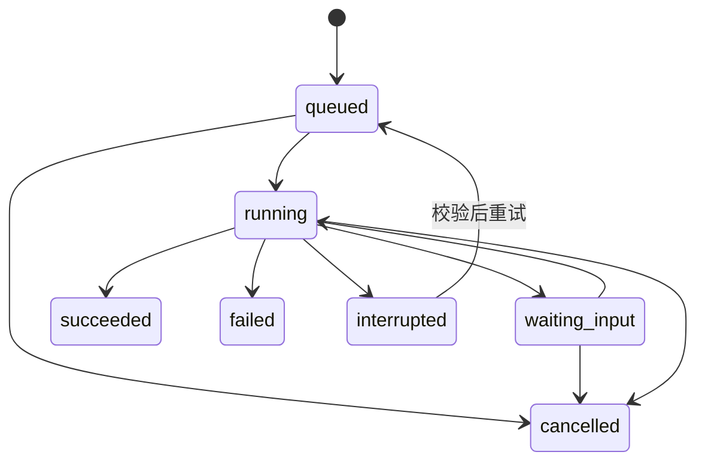

# MANGA Agent、上下文与插件协议

| 项目 | 内容 |
| --- | --- |
| 文档编号 | DESIGN-MANGA-AGENT |
| 版本与日期 | 0.4 / 2026-09-19 |
| 状态 | 评审稿；类型片段用于定义契约语义 |
| 治理与决定 | [文档治理](../governance/documentation-policy.md)；[确认与待决事项](../decisions/open-questions.md)；文档状态不代表实现通过 |
| 对应需求 | BASE-01、CTX、AGENT、MODEL、SEARCH、PLUG 系列 |
| 相关文档 | [总体架构](architecture.md)、[领域与数据](domain-model.md)、[交互流程](interaction-and-workflows.md) |

## 1. Agent 原生能力的定义

Agent 与界面是应用能力的两个调用入口。应用服务决定操作是否合法、写到哪里、如何保存和撤销；模型负责理解任务、选择工具与生成候选内容。

每个模块提供可查询状态和可调用操作。Agent 不需要通过模拟点击才能获得应用内信息，也不能通过直接修改数据库绕开业务约束。界面状态、资源位置和任务数据通过结构化上下文提供。

阅读、编辑、录音、检索等功能可分别运行；Agent 主循环可以关闭或替换。录音转写和整理使用模型路由服务，不强制依赖对话 Agent。

Feature/Module/Facet/Provider/Bundle/Profile 关系、确定性绑定与运行时选型见[组合架构方案](composable-ai-native-architecture.md)。本文继续拥有命令与上下文协议；元数据和下载命令按[外部扩展设计](external-providers-and-acquisition.md)接入同一网关。

## 2. 能力注册模型

### 2.1 能力分类

| 类型 | 作用 | 例子 |
| --- | --- | --- |
| Query | 返回受控业务状态 | 查询当前资源、读取笔记、查找引用 |
| Command | 执行业务操作 | 创建笔记、跳转位置、添加材料、导出片段 |
| ContextProvider | 构造轻量上下文和按需材料 | 小说选区、漫画区域、字幕窗口 |
| View | 向宿主贡献可显示页面与嵌入视图 | 阅读器、白板、笔记卡片 |
| Provider | 实现模型、媒体、搜索等底层接口 | ASR、嵌入、视频探测 |
| Workflow | 编排多个可恢复阶段 | 录音→转写→整理→笔记 |

命令与查询拥有命名空间和协议版本，例如 `notes.create` / `v1`。模型供应商对工具名称有格式约束时，由适配器建立稳定映射，不修改内部能力身份。

### 2.2 能力描述

每项能力必须包含 ID、版本、所属模块、说明、输入与输出 schema、错误结构、作用范围和成本/副作用描述。

修改命令还需声明：

- 目标对象类型与预期修订要求。
- 是否支持预览、幂等、取消和撤销。
- 是否写入业务数据、磁盘文件或外部系统。
- 是否使用网络、付费模型或大量计算。
- 调用者需要的授权及可复用的授权范围。

这些声明由宿主执行和验证，不能只放在提示词里。TS 类型不能替代对运行时输入的 schema 检查。

### 2.3 初始工具示例

| 工具 | 主要输入 | 主要结果 | 属性 |
| --- | --- | --- | --- |
| `library.find` | 关键词、媒介、范围 | 资源摘要与 ID | 读取 |
| `content.resolveAnchor` | anchorId | 解析状态与可导航目标 | 读取 |
| `reader.getSelection` | 上下文快照或窗口句柄 | 选区、来源与版本 | 读取 |
| `notes.create` | 内容、来源、归属 | objectId、revision、引用 | 可撤销写入 |
| `notes.proposeEdit` | 目标与预期版本、修改意图 | 候选稿、差异、planId | 生成草稿 |
| `notes.applyEdit` | planId、预期版本 | 新 revision、操作记录 | 可撤销写入 |
| `projects.addMaterial` | projectId、目标引用 | 材料记录 | 可撤销写入 |
| `board.addReference` | 白板目标、引用、位置 | 卡片 ID 与新 revision | 可撤销写入 |
| `clips.planExport` | 粗剪目标与输出设置 | 兼容报告、实际区间、planId | 预览/计算 |
| `clips.export` | 已校验 planId、输出授权 | jobId、结果位置 | 文件写入 |

表中工具随相应里程碑启用。工具列表按任务发现并加载，调用入口始终重新验证实际模块状态，不能仅凭模型看过工具定义就执行。

## 3. 命令协议与一致性

### 3.1 命令封装

```ts
interface CommandEnvelope<TInput = unknown> {
  protocolVersion: 1;
  requestId: string;
  commandId: string;
  commandVersion: number;
  actor: { kind: 'user' | 'agent' | 'workflow'; id: string };
  scopeHandle: string;
  contextSnapshotId?: string;
  registryGeneration: number;
  idempotencyKey: string;
  expectedRevisions: Array<{
    targetKind: 'object' | 'resource' | 'project' | 'config';
    targetId: string;
    revision: string | number;
  }>;
  input: TInput;
}
```

actor、scopeHandle、注册代次和任务关联由可信调用层填写或校验，不能允许模型在参数中自称获得更高权限。修订保护按目标类型验证：创作对象使用整数修订，资源使用当前资源修订 ID；新建对象可以没有已有目标保护。文件操作还需经平台层绑定路径或资源授权句柄。

### 3.2 执行顺序

1. 验证协议、输入结构和调用来源。
2. 检查模块仍启用、能力版本可用、权限范围满足。
3. 按幂等键检查已提交操作；重复请求返回同一逻辑结果。
4. 校验目标存在、所属范围与预期修订；失效目标返回结构化错误。
5. 执行必要的本地预检；长计算或网络操作先转为任务。
6. 在事务内提交业务数据、修订、撤销信息、操作记录与事件。
7. 返回已提交结果，刷新界面与上下文投影。

一个用户请求的重试沿用逻辑幂等键。用户主动“再生成一个版本”属于新命令，使用新幂等键并保留与原任务的关系。

### 3.3 冲突、预览与撤销

- 目标版本变化时返回 `REVISION_CONFLICT`，保留建议稿；不能自动以新目标内容替换原输入并覆盖用户修改。
- 预览计划包含目标修订、授权范围、预期副作用和有效期。执行前再次校验；失效后重新生成预览。
- 可撤销命令记录恢复所需的信息。撤销也进行目标修订校验，后续编辑存在冲突时展示比较或恢复为新副本。
- 外部请求、永久删除和已经完成的文件覆盖只有明确实现了恢复方案才展示“撤销”。
- 显示计划、工具行为和引用证据，不依赖展示模型内部推理过程。

## 4. 上下文协议

### 4.1 页面上下文契约

所有可打开页面声明：页面类型、活动资源/对象、位置或选区、修订版本、可查询状态、支持的工具和可获得材料。

页面上下文只报告其真实掌握的事实。例如动画页面可以报告播放位置和已有字幕，视觉解释需要另行提取画面；时间码本身不等于剧情理解。

```ts
interface ContextSnapshot {
  id: string;
  createdAt: string;
  actorScopeHandle: string;
  mode: 'enthusiast' | 'creator';
  projectId?: string;
  focus: { windowId: string; viewId: string; viewType: string };
  targets: Array<{
    kind: 'resource' | 'object';
    id: string;
    revision: string | number;
    anchorIds?: string[];
  }>;
  observations: Array<{
    providerId: string;
    sequence: number;
    observedAt: string;
    freshness: 'current' | 'stale' | 'unavailable';
    data: unknown;               // 按 provider schema 校验
  }>;
  permittedRanges: unknown[];   // 使用领域定位与范围 schema
  includedSources: Array<{
    sourceId: string;
    revision: string | number;
    extraction: 'text' | 'ocr' | 'subtitle' | 'frame' | 'user-note';
    provenanceId: string;
  }>;
}
```

快照是创建时的不可变记录。后续增补材料形成追加的上下文记录和新证据清单，原始目标继续保留。最终写入使用明确目标 ID 和修订，不重新读取“当前页面”来猜测目的地。

### 4.2 四层上下文

| 层 | 内容 | 提供时机 |
| --- | --- | --- |
| 环境摘要 | 模式、项目、页面、能力可用状态 | 每次任务的轻量基础信息 |
| 当前焦点 | 资源、位置、选区、目标修订 | 发起任务时固定 |
| 邻近材料 | 相关段落、附近字幕、选中图像区域、相关笔记 | 按任务与预算选择 |
| 扩展材料 | 跨资源检索结果、项目设定、外部资料 | 明确查询后加入 |

状态可查询不意味着把全部状态主动注入模型。播放、鼠标和滚动事件首先维护本地状态；模型请求只在任务或用户配置的工作流触发时发生。

### 4.3 上下文选择与预算

执行顺序为：有效授权 → 当前项目/任务材料 → 进度边界 → 版本与来源校验 → 相关性排序 → 文本/图像预算裁剪。

- 模型上下文上限、输出预留与用户预算共同限制材料量。
- 全文、OCR、字幕和截图按需提取；默认不将整集视频或整部漫画提交给模型。
- 原文和用户选区优先保留，派生摘要必须附来源并标明提取方式。
- 引用信息和约束不能在摘要压缩中被丢弃；压缩结果仍保留目标和证据 ID。
- 用户可以查看、移除、固定材料；固定材料仍受授权、资源版本和进度限制。
- 重新查询时在存储层执行范围过滤，不能先把全部资料送到模型再要求其忽略越界部分。

### 4.4 临时状态的新鲜度

每个提供器维护观察序号与时间。未及时收到页面状态时返回 stale 或 unavailable，调用方可以刷新，不能把缓存位置称为当前实时位置。

录音时间绑定由采集工作流维护，不依赖 Agent 快照的刷新频率。来源文字、图像中出现的指令始终作为材料数据处理，不能产生授权或改变系统能力。

## 5. Agent 任务运行

### 5.1 任务记录

AgentRun 保存会话 ID、用户请求、初始快照、目标列表、模型路由、有效授权句柄、预算、阶段状态、工具操作和结果引用。

状态机与宿主任务一致：



取消请求与已完成取消分开表示：正在运行时可以标记 cancelRequestedAt，只有执行器确认停止或保存可恢复检查点后，才进入 cancelled。进程崩溃且副作用状态未知时进入 interrupted，先核查再恢复。

### 5.2 最小运行循环

1. 固定任务范围与上下文。
2. 根据任务发现可用工具，载入必要说明与 schema。
3. 路由模型生成回答或工具调用。
4. 校验工具输入、权限和模块状态，执行并记录结果。
5. 按需要补充证据，继续下一轮。
6. 达到完成条件、预算/步骤上限、需要输入或取消时结束当前运行阶段。

首版以单个有界 Agent 运行循环为基线，不预设必须多 Agent 并发。每个运行配置 maxSteps、maxDuration 和费用/上下文预算，避免无界调用。

### 5.3 输出形式

回答包含必要的来源引用；创作任务生成可编辑对象、候选稿或明确的修改计划。长任务返回 jobId 和进度。失败保留已成功的中间产物，用户可以继续工作或重试。

## 6. 权限、授权与来源边界

### 6.1 默认产品策略

| 动作 | 默认行为 |
| --- | --- |
| 读取当前已授权资源与项目材料 | 在有效范围内执行 |
| 用户明确要求创建笔记或草稿 | 视请求为该范围的授权，直接创建可撤销结果 |
| 修改已授权对象 | 按设置执行可撤销修改或展示差异；版本校验始终执行 |
| 大批量改动、永久删除、覆盖外部文件 | 先产生具体影响清单和预览，缺少已有授权时再确认 |
| 调用已配置的云模型 | 按该功能已有的材料与网络授权发送必要内容；界面可检查来源 |
| 扩大到其他项目、整库材料或新外部服务 | 需要扩展范围的明确授权 |

授权应当可按任务、项目或用户配置复用，避免每一个工具步骤重复询问。显式关闭的模块或范围不能被模型自动重新打开。

### 6.2 凭据与敏感信息

凭据保存于平台凭据接口，数据库只保存 credentialRef。渲染页面可设置凭据但不能通过普通上下文查询读回；模型、工具日志、资料包与错误信息不含密钥。

权限作用于实际能力调用。工具提示词、插件自报权限和普通子进程都不足以成为不可信代码的隔离保证。

## 7. 插件清单与入口

### 7.1 清单概念

```ts
interface ModuleManifest {
  manifestVersion: 1;
  id: string;
  version: string;
  hostApiRange: string;
  // trustClass 属于宿主安装记录，不由插件自报。
  facets: { service?: string; ui?: string; worker?: string };
  provides: Array<{ capabilityId: string; apiVersion: string; exclusive?: boolean }>;
  requires: Array<{
    capabilityId: string;
    apiRange: string;
    optional: boolean;
    cardinality: 'single' | 'many';
  }>;
  permissions: string[];
  configSchemaId: string;
  ownedObjectTypes: Array<{ type: string; schemaVersion: number }>;
  contributes: {
    features: string[];
    views: string[];
    commands: string[];
    contexts: string[];
  };
  lifecycle: { disable: 'drain' | 'restart'; codeUpdate: 'hot' | 'restart' };
}
```

宿主安装记录中的 trustClass 由实际执行环境、校验和安装来源决定，不能因为插件自称 builtin 就获得可信身份。模块可以声明多个能力，是否向 Agent 暴露由注册规则和授权共同决定。服务 API 采用 SemVer，命令 commandVersion 继续使用整数；数据格式与运行代次各自独立。

### 7.2 作用域与注册

模块在 activate(ctx) 阶段通过宿主上下文注册能力。所有注册返回释放句柄，并纳入模块作用域。定时器、监听器、连接和后台任务也必须绑定生命周期；激活失败时回滚已完成注册。

MANGA 拥有公开插件 SDK、命令、上下文和数据协议。运行时实现须遵守这些协议，服务注册、依赖绑定与作用域清理须可验证；职责与选型要求见[组合方案第 2 节](composable-ai-native-architecture.md#2-组合运行时的职责与验证)。

清单负责在激活之前声明依赖与贡献形状，激活阶段只注册已声明的实际实现并申请受管理资源。运行时实现若区分同步声明和异步激活，由内部适配层转换；业务插件只通过 MANGA SDK 获取能力，不持有具体运行时的私有上下文或调用内核私有接口。Agent 工具映射是能力目录的消费者，停用 Agent 不停止组合内核，替换组合内核也不改变 CommandEnvelope、ContextSnapshot 和业务对象身份。

## 8. 插件生命周期与依赖

### 8.1 状态

模块状态包括 discovered、disabled、resolving、activating、active、draining、blocked 和 failed。

- discovered：清单被识别，尚未决定装配。
- disabled：用户或宿主配置未启用。
- resolving：解析依赖与提供者绑定。
- activating：创建作用域与注册服务。
- active：可以接受新的调用。
- draining：停止新调用，处理已开始的任务与释放资源。
- blocked：缺少依赖、版本或权限条件。
- failed：激活或运行出现需要恢复的问题。

必须检测硬依赖循环；可选依赖缺失时关闭相应增强。排他能力的多个提供者不能按扫描顺序随机选用，必须有明确绑定。

### 8.2 停用流程

1. 计算硬依赖、活动视图、待处理任务和正在使用的对象，形成影响清单。
2. 按用户已有请求与配置确认停用范围；存在未处理草稿或不可中断任务时提供具体处理方式。
3. 状态进入 draining，撤销新的工具调用与工作流入口，增加注册代次。
4. 对可取消任务发出取消，对需要收尾的任务保存检查点；短事务完成后退出。
5. 释放上下文提供器、事件监听、定时器、设备、视图和连接。
6. 保留模块配置、原始数据与公共预览，进入 disabled。

停止准入与数据库写入之间必须有提交屏障：已经获得租约的短事务排空后，旧模块/绑定 epoch 不再允许提交。全局 registryGeneration 用于目录变化，具体模块/绑定 epoch 判定受影响调用，避免无关插件更新取消全部任务。详细竞态、停用与热更新边界见[组合方案第 7 节](composable-ai-native-architecture.md#7-生命周期与真正的停用)。

依赖它的模块按依赖图同步进入不可用或降级状态，重新启用时按拓扑顺序恢复。单纯隐藏页面不执行该流程。

### 8.3 过期调用与晚到结果

- 模型持有的旧工具定义在执行时返回 CAPABILITY_UNAVAILABLE，不能绕过 disabled 状态。
- 异步结果携带任务和注册代次。模块已经停用时，只能保存为可恢复产物或中断记录，不能继续应用到目标对象。
- 强制停止辅助进程前尽可能保存已确认部分；无法确定副作用完成情况时记录 interrupted 并核查。
- 停用与卸载代码都不默认删除模块数据。数据清理是单独、可查看影响范围的操作。

### 8.4 插件数据升级与未知类型

模块声明 ownedObjectTypes 和迁移链。安装新版前检查格式兼容，事务性迁移，保留备份。恢复旧插件但数据库格式过新时只读打开或使用兼容备份，不任意降级写入。

未知类型的对象按公共封装保留 payload、预览、引用和附件。模块必须将附件和跨对象关系登记到公共清单，使宿主在不加载模块代码时也能枚举导出依赖。重新安装相应能力后恢复编辑；即使尚未安装，也可以完整导出原始封装。

### 8.5 第三方插件开放边界

M1 使用内置插件和显式受信任的开发插件。工作线程或独立 Node 进程仅解决性能/故障边界，不能因此宣称不可信代码无权访问宿主系统。

M4 的第三方方案需要在受限渲染环境、WASM、受约束 RPC 或操作系统沙箱等方式中完成实际验证，包含文件、网络、凭据、CPU/内存与进程能力限制。未达标前不开放任意不可信执行代码安装；清单、声明式材料或受信任插件的分发能力可分别交付。

## 9. 模型连接、能力与路由

### 9.1 三层配置

| 层 | 主要字段 |
| --- | --- |
| ProviderConnection | providerAdapterId、baseUrl、credentialRef、连接状态、用户允许的数据范围 |
| ModelProfile | connectionId、modelId、能力集合、上下文上限、默认参数、已验证状态 |
| TaskBinding | taskType、主模型、允许的回退模型、预算、项目级覆盖 |

初始任务类型包括 chat、note.organize、writing.revise、translate、embedding、speech.user、speech.media、vision.describe 和 ocr.extract。任务类型独立于供应商与模型名称。

能力至少区分文本、工具调用、结构化输出、图像输入、音频转写、流式响应和嵌入。配置测试报告实际可用能力，不以“接口地址兼容”推定全部特性可用。

### 9.2 供应商适配

OpenAI 兼容适配器作为首个候选实现。内部采用任务接口，不把请求路径、供应商消息格式和模型特有参数写入领域对象。具体端点和兼容差异在实现时用锁定版本与适配器契约测试确认。

本地端点和远程端点分别表达网络与数据授权。回退模型只能使用用户已允许的路由；本地模型失败不会自动把材料提交给未经授权的远程服务。

### 9.3 可靠性与成本

- 区分认证失败、能力缺失、限流、网络失败、内容大小限制和输出格式错误。
- 仅对适合重试的失败执行有上限的退避；远程请求是否实际计费由提供者决定，取消不能被描述为必然免计费。
- 记录已知用量和估算，区分真实费用与估计值。
- 对转写、OCR、嵌入按输入指纹、模型配置与版本缓存结果，避免重复计算。
- 超出预算或步骤上限时暂停并展示已完成内容，保留继续入口。

## 10. 搜索与派生材料

全文检索优先支撑标题、别名、正文和笔记。中日文需要专门样本验证，不能直接假设默认分词器满足检索需求。可选嵌入索引记录提供者、模型、维度、分段规则和来源修订。

检索命中是带来源定位的片段，不是脱离原文的向量 ID。构造上下文前再次校验资源修订与有效范围；过期索引项丢弃或重新提取。

更换模型、维度或分段规则时创建新索引版本，重建完成前保留可用全文搜索；切换后再按策略清理旧索引。

## 11. 错误协议与可观测性

错误统一包含 code、可读说明、是否可重试、相关对象/任务 ID 和恢复动作。敏感路径和提供者原始错误经过清理。

主要错误码包括 VALIDATION_ERROR、FORBIDDEN、CAPABILITY_UNAVAILABLE、REVISION_CONFLICT、RESOURCE_UNRESOLVED、UNSUPPORTED_FORMAT、MODEL_CAPABILITY_MISSING、AUTHENTICATION_FAILED、PROVIDER_UNAVAILABLE、RATE_LIMITED、BUDGET_EXCEEDED 和 CANCELLED。

运行记录包含任务状态、工具 ID、输入摘要、目标修订、来源 ID、耗时、用量和结果对象。日志默认不记录密钥、整段原始录音或整本正文；调试材料采集需要明确开启并有清理方式。

## 12. 协议验收要求

- 相同输入从界面和 Agent 进入，形成等价业务结果。
- 重试一个已提交创建命令，不出现第二份笔记。
- 任务运行期间更换页面，结果仍指向原对象。
- 用户修改目标后，旧计划不能直接覆盖新修订。
- 模块停用后，旧工具、订阅和晚到回调不能继续改变业务状态。
- 模型能力缺失、取消和预算上限有可解释结果。
- 查询与检索范围不能被模型提供的参数扩大。
- 资料中的指令不能获得外部访问、文件写入或新增权限。

完整阶段与用例映射见[交付与验收](../delivery/roadmap-and-acceptance.md)。
