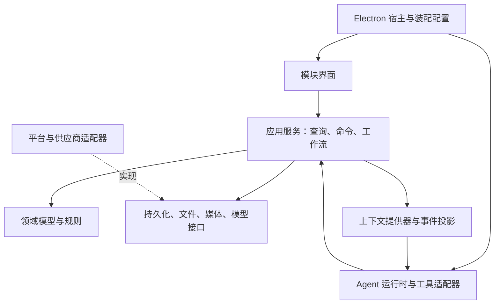

# MANGA 总体架构设计

| 项目 | 内容 |
| --- | --- |
| 文档编号 | DESIGN-MANGA-ARCH |
| 版本与日期 | 0.4 / 2026-09-19 |
| 状态 | 评审稿；具体库版本与媒体后端待 M0 验证 |
| 治理与决定 | [文档治理](../governance/documentation-policy.md)；[确认与待决事项](../decisions/open-questions.md)；文档状态不代表实现通过 |
| 输入 | [产品需求](../product/requirements.md) |
| 详细设计 | [领域模型](domain-model.md)、[Agent 与插件](agent-and-plugins.md)、[界面与工作流](interaction-and-workflows.md) |

## 1. 架构目标

系统采用本地模块化单体：一个桌面宿主组合多个业务模块，通过明确的接口和生命周期协作。业务能力可拆分，运行时不默认引入远程微服务。

组合、运行时选型、功能中心与生命周期细化见[可组合与 AI-Native 架构方案](composable-ai-native-architecture.md)。M0 对运行时候选执行统一契约验证，完成后选择一个生产实现。所有业务功能可不安装、停用或替换；维持宿主运行的基础接口必须保留可用实现。外部数据库与下载接入见[外部扩展设计](external-providers-and-acquisition.md)。

必须保持以下不变量：

1. 用户界面和 Agent 的同类操作经过同一个应用服务。
2. 领域逻辑不依赖 Electron、界面组件、模型 SDK 或其他模块私有实现。
3. 所有持久化修改具有明确的数据所有者、事务边界与修订版本。
4. 资源、引用和创作对象的身份独立于文件路径、页面布局与组件实例。
5. 业务模块停用后，其数据和持久引用可保留、备份与导出。
6. Agent 上下文来自受控查询和快照；持续业务事件不等于持续模型调用。
7. 本地业务状态是事实来源，模型输出通过业务校验后才成为持久修改。

## 2. 分层与依赖



| 层 | 职责 | 不应承担的职责 |
| --- | --- | --- |
| 领域 | 内容身份、定位、进度、编辑与引用规则 | 窗口控制、网络请求、DOM 操作 |
| 应用服务 | 校验权限与版本、编排业务命令、定义事务与结果 | 直接依赖具体界面，执行任意模型生成代码 |
| 界面 | 展示状态、接受输入、提供可访问交互 | 绕过命令层写入数据库 |
| Agent 适配 | 将工具调用转为命令，构造上下文，管理任务 | 拥有一份独立且可冲突的业务数据库 |
| 平台/供应商适配 | 文件、数据库、媒体进程、凭据与模型接入 | 定义小说引用或笔记修改等业务语义 |
| 最小内核 | 服务注册、模块依赖、生命周期、事件与任务基础设施 | 内置所有媒介与创作功能 |

共享契约中只放稳定的数据结构和接口。对业务特定的实现留在对应模块，避免把 `shared` 或全局状态库变成隐含耦合中心。

## 3. Monorepo 组织

以下是拟采用的结构，并非已经创建的应用源码。

```text
apps/
  desktop/                    Electron 启动、窗口、装配、打包
  reader-host/                M1 的最小独立宿主验证工程
packages/
  contracts/                  ID、消息、定位与服务接口
  kernel/                     模块、依赖、注册、生命周期、任务基础设施
  ui/                         视觉组件、布局与可访问交互
  platform-electron/          IPC、文件授权、凭据、原生能力桥接
  storage-sqlite/             持久化接口的 SQLite 实现
modules/
  library/                    作品、版本、本地资源与进度
  content/                    内容对象登记、锚点与引用公共能力
  novel/                      小说解析、排版与交互
  comic/                      漫画清单、页面与区域交互
  anime/                      播放、字幕、媒体位置与帧提取
  notes/                      笔记语义、编辑与修订
  capture/                    用户录音、时间绑定与转写工作流
  projects/                   创作项目与材料集合
  board/                      白板布局与关系
  mindmap/                    思维导图树与视图
  writing/                    文案工作流与修改建议
  research/                   资料获取与来源归档
  search/                     全文、语义索引与检索
  clips/                      粗剪项目与导出工作流
  model-routing/              连接、模型能力、任务路由与预算
  agent/                      会话、运行循环、工具使用与结果展示
providers/
  openai-compatible/          初始模型协议适配
  ...                         后续供应商、OCR、搜索与媒体后端适配
```

每个模块可以先按 `domain/`、`application/`、`ui/`、`plugin/` 分目录，并通过包导出声明公开入口；不要求每个目录成为独立包。阶段内未实现的模块不创建空壳注册占位来伪装功能完成。

上面的目录是初始逻辑结构。0.2 将 `novel/comic/anime` 的格式解析与阅读播放交互划成可分别装配的责任，并增加 `composition`、运行时适配、元数据、获取、传输、Bundle 与 Profile；完整增量布局以[组合方案第 11 节](composable-ai-native-architecture.md#11-工程结构与约束)为准。

构建要求：

- pnpm workspace 统一依赖与脚本，具体构建缓存工具在需要时引入。
- TypeScript 使用严格类型检查；进程边界、插件配置和持久化载荷同时具有运行时 schema。
- 公共领域入口只依赖跨平台接口；通过包导出和依赖检查阻止跨模块私有导入。
- Electron 和模型 SDK 版本在实现阶段锁定；不把第三方 SDK 类型泄漏为领域公共协议。

## 4. 进程、权限与数据所有权

### 4.1 运行角色

| 角色 | 主要职责 | 数据/权限边界 |
| --- | --- | --- |
| Electron 主进程 | 窗口、应用生命周期、系统对话框、IPC 入口、凭据与本地能力授权 | 校验调用窗口、frame、来源和参数；不承担大量解析 |
| 应用渲染进程 | 三栏界面、模块视图、输入、麦克风采集和当前阅读/播放状态 | 通过受限桥接调用服务；不直接访问 Node 或数据库 |
| 核心服务进程 | 内核、应用服务、数据库写入、模型路由、任务和上下文聚合 | 作为 SQLite 唯一写入所有者；重启后重建投影 |
| 工作线程/辅助进程 | 解析、索引、缩略图、媒体探测与导出等耗时任务 | 仅接收任务需要的数据或已解析的路径，不独立改写业务库 |
| 受限内容视图 | EPUB 内容或外部资料的渲染 | 不暴露应用桥接，不执行来源中的主动脚本 |

核心服务初始建议放在 Electron utility process 中。其领域和应用代码仍是平台无关模块，独立宿主可以在普通 Node 进程中装配相同服务。

### 4.2 跨进程消息

- `preload` 暴露按用途划分的方法，如查询资源、提交命令、订阅任务；不暴露任意 IPC、文件读写或 shell 执行。
- 消息具有协议版本、请求 ID、窗口/任务身份、范围、类型和运行时校验。
- 大图片、音频和视频通过受控流、附件句柄或资源协议传递，避免大体积二进制重复塞入 JSON 消息。
- IPC 入口校验真正的调用 frame 和范围；渲染进程提供的项目 ID 不直接构成授权。
- 请求可取消，响应可关联；核心服务不可用时明确显示恢复状态，拒绝假装保存成功。

### 4.3 内容渲染与资源访问

本地文档同样视为不可信输入。EPUB/HTML 在解析后进行样式和内容清理，以不具备应用能力的视图显示。网络资料使用独立、受限的浏览内容环境。

媒体资源通过资源 ID、版本和经过校验的相对条目访问；对 ZIP 路径穿越、目录越界、符号链接跳转、解压膨胀和超大尺寸设置限制。视频访问需要正确支持范围读取。

Electron 的上下文隔离、渲染沙箱和 IPC 校验是宿主基础约束。它们不能替代对任意第三方 Node 插件的权限隔离。

## 5. 数据流与事务

### 5.1 查询

界面或 Agent → 查询接口 → 权限与范围筛选 → 业务查询/只读投影 → 返回携带修订版本的结果。

当前焦点、选区和播放位置来自渲染侧的临时状态提供器；持久内容来自数据服务。聚合快照说明各部分的观察时间与版本，不伪装成跨所有设备和进程的瞬时一致状态。

### 5.2 修改

1. 收到带目标、预期版本和幂等键的命令。
2. 校验能力启用状态、作用范围、输入结构与业务规则。
3. 在短事务内更新业务数据、对象修订、操作记录和待发布事件。
4. 事务提交后返回持久化确认，并发布事件供界面、搜索和上下文更新。
5. 消费方根据事件序号去重；发现缺口时重新查询快照。

采用当前状态表加操作记录与事务事件表，不要求第一版实现完整事件溯源。事件用于变更传播和恢复，不能代替正式数据备份。

创建带来源的笔记是一个应用级复合命令，在同一事务中建立对象、锚点和引用。跨模块动作通过受控服务和统一工作单元协作，避免出现笔记保存成功但引用缺失的中间状态。

此同库事务仅由受信任本地应用服务协调，不向第三方插件暴露事务连接，也不在事务内调用远端提供者。下载、外部资料匹配和导入通过幂等工作流与回执恢复；文件发布和数据库提交之间的核查协议见[获取一致性](external-providers-and-acquisition.md#6-下载文件与数据库的一致性)。

### 5.3 长任务

网络请求、OCR 和媒体导出不放在数据库事务内。长任务先固定输入快照并保存任务，再异步计算，最后校验目标版本并提交结果。

任务状态至少覆盖 `queued`、`running`、`waiting_input`、`succeeded`、`failed`、`cancelled`、`interrupted`。可恢复检查点保存已完成阶段；一次任务可以有多个执行尝试，但只能按幂等规则提交一个逻辑结果。

## 6. 状态的四种归属

| 状态类型 | 例子 | 保存方式 | Agent 获取方式 |
| --- | --- | --- | --- |
| 持久业务状态 | 笔记、引用、已读区间、项目 | SQLite 和原始文件 | 受控查询 |
| 运行状态 | 任务阶段、播放状态、录音状态 | 内存，必要检查点持久化 | 运行查询与快照 |
| 界面临时状态 | 焦点、选区、展开、滚动、布局 | 窗口内状态；部分用户偏好落盘 | 页面上下文提供器 |
| 派生状态 | 搜索索引、缩略图、OCR 缓存 | 带来源与版本的可重建存储 | 带证据与有效性检查的检索 |

不建立一份包含全部数据、权限和界面状态的万能全局对象。页面可维护自身临时状态，但所有有业务意义的修改都经过应用服务。

连续位置变化在内存中更新，进度按节流和关键事件保存；需要录音绑定时立即取样。播放每一帧不写数据库，也不逐帧通知模型。

## 7. 模块之间的协作

### 7.1 主要能力与所有者

| 能力 | 默认提供模块 | 主要消费者 |
| --- | --- | --- |
| 资源目录、版本与进度 | `library` | 阅读、播放、搜索、项目、Agent |
| 内容对象登记、锚点和引用 | `content` | 笔记、白板、思维导图、粗剪 |
| 小说定位与渲染 | 小说格式能力 + 小说阅读器 | 界面、引用导航、上下文 |
| 漫画清单、定位与图像区域 | 漫画格式能力 + 漫画阅读器 | 界面、OCR、上下文；阅读器停用不强制移除格式能力 |
| 视频位置、字幕与帧 | 视频格式能力 + 动画播放器 | 界面、录音绑定、粗剪、上下文 |
| 录音和转写工作流 | `capture` | 笔记与用户界面 |
| 模型能力与任务路由 | `model-routing` | 转写、搜索、文案、Agent |
| 可检索片段与索引 | `search` | 全局搜索、研究、Agent |
| 外部身份、资料候选与字段策略 | `metadata` + 可选数据库提供者 | 资源库、研究、Agent |
| 获取计划、传输与导入编排 | `acquisition` + 下载源/传输提供者 | UI、Agent、工作流；本地库不反向依赖下载 |

`content` 负责公共身份和引用结构，具体内容语义仍归笔记、白板等模块。解析来源定位时通过可选的资源解析能力查验，不能让公共内容登记与资源目录形成循环依赖。

### 7.2 硬依赖与可选增强

- 小说阅读的硬依赖是资源访问和基础持久化；带书签与引用时装配公共引用能力。
- AI 解释是阅读的可选增强；阅读模块不依赖 Agent 运行循环。
- 录音可以独立采集并保存；ASR 可用时增加转写，整理模型可用时增加整理稿。
- 笔记的核心编辑不依赖模型；白板可以引用笔记，也可以引用其他已注册内容对象。
- 使用能力 ID 声明依赖，具体提供者由宿主配置绑定。同一排他能力只能有一个有效提供者；非排他能力可按消费者 single/many 绑定多个实例；切换时执行依赖协调，集合聚合语义由领域消费者负责。

基础存储与注册服务可以替换，但当前宿主有依赖运行时必须保留可用提供者。界面应解释被依赖的服务，不能允许关闭最后一个提供者后留下损坏状态。

### 7.3 界面与后台生命周期

视图实例与业务服务分别管理。关闭标签页、隐藏侧栏、切换模式只改变展示或用户焦点；只有显式停用模块才触发依赖检查、任务处理和资源释放。具体停用协议见[Agent 与插件设计](agent-and-plugins.md)。

## 8. 本地文件、数据库与备份

- 媒体默认由用户选择位置并建立引用；托管复制作为选项。
- 数据库保存资源身份、位置记录、修订、引用、任务与索引元数据；大附件保存在附件目录。
- 内容哈希用于版本核对和重复检测，不作为所有对象唯一的业务 ID。
- 外部文件移动通过 `FileLocation` 修复；新版资源不能静默覆盖旧引用的含义。
- 备份通过数据库提供的快照/备份能力产生一致副本，不能只复制运行中的单个 SQLite 文件而忽略 WAL 状态。
- 恢复先验证备份完整性和格式版本，再替换或导入；凭据重新绑定，不随普通项目包导出。
- 可移植资料包使用 `.manga-bundle`，导出对象、引用、来源描述和可选附件；具体格式见[领域模型](domain-model.md)。

## 9. 自研与底层依赖边界

| 自主实现的核心 | 允许采用的必要底层技术 |
| --- | --- |
| 组合契约、功能启停、配置语义、权限网关与恢复规则；精简运行时列为自研候选 | Electron/Node.js、schema 校验、版本解析、构建工具；运行时适配层须通过统一契约验证 |
| 内部文档结构、定位恢复、阅读排版与进度 | ZIP 解压、字符解码、DOM/浏览器布局基础 |
| 播放器界面、状态、字幕解析与内容引用 | 浏览器媒体能力、经验证的原生解码和字幕排版基础 |
| 笔记、白板、思维导图的数据与编辑行为 | 必要的输入、文本编辑或绘制底层；版本在 M0 确定 |
| 粗剪项目、兼容性检查、导出计划 | FFmpeg/ffprobe 等基础媒体工具 |
| Agent 工具、上下文、模型路由和工作流 | HTTP、模型供应商适配、可替换的 Agent 运行基础 |

不把自主实现等同于用 TypeScript 重写编解码器。业务仍以 TS 实现，必要原生二进制由平台适配器封装。所有外部进程采用参数数组调用，用户文件名和模型文本不能拼入 shell 命令。

UI 框架、文本编辑内核和媒体后端不在本版提前锁定；M0 必须以中文输入、选区稳定性、目标格式与打包验证为选择依据。

自研组合运行时以 TypeScript 实现插件声明、依赖绑定、作用域、生命周期、调用代次和诊断。配置解析、权限策略、业务服务、Agent 工具映射和数据迁移各有所有者，不能全部塞入内核。详细职责与验证要求见[组合方案第 2 节](composable-ai-native-architecture.md#2-组合运行时的职责与验证)。

初期支持可信内置模块及 Electron 多进程边界，以快照加有序事件同步状态。复杂状态增量编码、通用分布式服务和任意第三方执行隔离在实际需要的阶段引入；功能启停必须可靠，代码升级和复杂依赖变化可先通过重启生效。运行时选择独立于模型 SDK 与 Agent 推理循环的选择。

## 10. 故障与恢复

| 故障 | 处理 |
| --- | --- |
| 渲染进程刷新或崩溃 | 从业务快照和用户布局恢复，未提交的 UI 输入依靠草稿检查点恢复 |
| 核心服务进程退出 | 先显示服务恢复状态；重启后打开数据库，标记运行中任务为 interrupted，校验后恢复 |
| 重复命令或网络重试 | 用幂等键返回已提交结果，避免重复创建笔记、引用与导出记录 |
| 模块激活失败 | 回滚本次注册与资源申请，保存错误，其他无依赖模块继续可用 |
| 模型输出格式错误 | 返回结构化失败并保留任务输入；未经校验的数据不执行为命令 |
| 导出中断 | 临时输出与完成文件分离，只有完整校验后发布完成文件；允许清理或重试 |
| 数据迁移失败 | 回滚事务并保留升级前备份；以只读或恢复模式打开，避免半迁移写入 |

已对外完成的网络操作或外部文件操作不承诺数据库式全局回滚。命令必须声明副作用与可恢复方式；用户界面只展示实际支持的撤销能力。

## 11. 独立应用拆分验证

M1 创建最小阅读宿主验证以下装配：

1. 加载资源、小说、引用与必要存储提供者。
2. 不加载创作模块和 Agent，完成导入、阅读、书签、恢复与引用跳转。
3. 注入一个不同于 Electron 桥接的测试宿主实现，执行同一组领域与应用服务用例。
4. 导入主应用导出的资料包，恢复资源身份、进度与引用；原始媒体未附带时允许重新定位。

该验证工程用于证明边界，不等同于承诺 M1 发布第二个面向用户的产品。

## 12. 设计决定与待验证事项

| 决定 | 本版取向 | 理由 / 验证 |
| --- | --- | --- |
| 本地模块化单体 | 采用 | 同机功能共享数据，减少不必要的网络和分布式一致性成本 |
| UI 与 Agent 共用服务 | 采用 | 保持业务规则、权限、修订和撤销一致 |
| 当前状态 + 操作记录 + 事务事件 | 采用 | 支撑恢复与订阅，避免首版全面事件溯源 |
| SQLite 单写入所有者 | 采用 | 清晰事务边界，避免各模块直接竞争数据库 |
| 依赖接口的插件系统 | 采用 | 允许内置能力替换与独立宿主装配 |
| 组合运行时实现 | M0 按统一契约验证运行时候选 | POC-07 验证生命周期、三个组合场景和维护成本，最终只选一个生产实现 |
| 进程隔离与插件权限隔离 | 分别实现 | 工作进程用于性能与故障边界；不可信代码另需受限运行环境 |
| 独立的媒体后端适配 | 采用 | 以格式矩阵决定浏览器或原生后端，不污染业务模型 |
| 具体界面/编辑/媒体库 | M0 决定 | 通过真实样本与输入行为验证后锁定 |

## 13. 验证重点

架构验收包括依赖方向检查、同一命令的界面/Agent 等价性、进程崩溃后的恢复、模块反复启停后的资源释放，以及最小独立宿主运行。具体样本与测试编号见[交付与验收](../delivery/roadmap-and-acceptance.md)。
