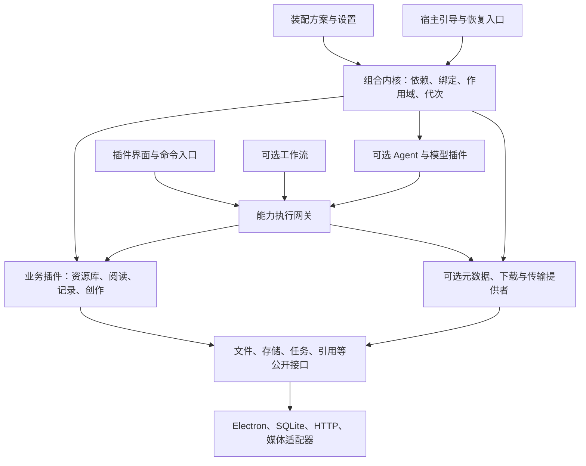
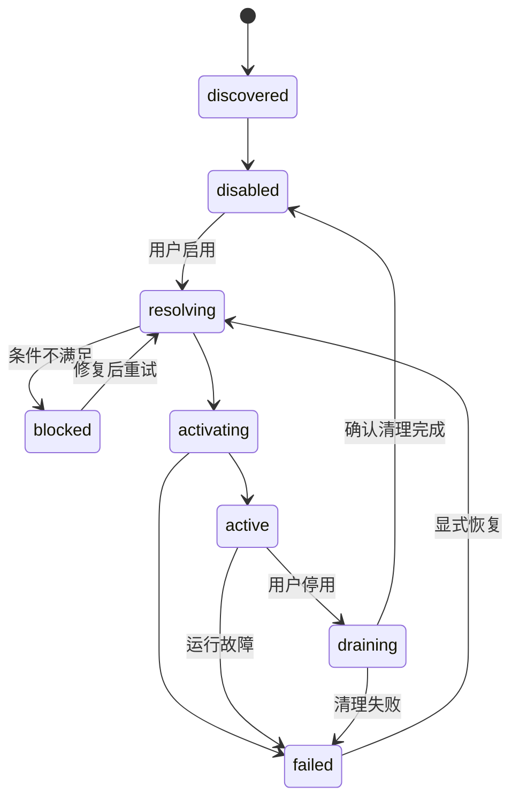
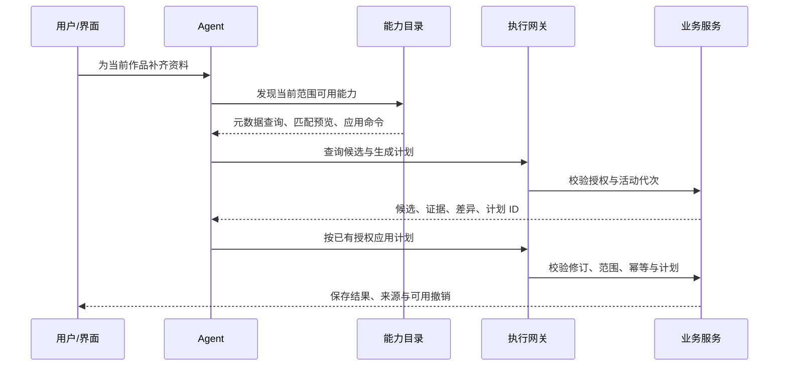

# MANGA 可组合、可拆卸与 AI-Native 架构方案

| 项目 | 内容 |
| --- | --- |
| 文档编号 | DESIGN-MANGA-COMPOSITION |
| 版本与日期 | 0.4 / 2026-09-19 |
| 状态 | 架构评审稿；协议示例为拟议设计，尚未实现或通过原型验证 |
| 治理与决定 | [文档治理](../governance/documentation-policy.md)；[确认与待决事项](../decisions/open-questions.md)；文档状态不代表实现通过 |
| 设计输入 | 当前 MANGA 文档、用户对功能拆卸/下载扩展/多动漫数据库组合的要求 |
| 配套文档 | [外部数据库与下载扩展](external-providers-and-acquisition.md)、[总体架构](architecture.md)、[Agent 与插件](agent-and-plugins.md)、[领域模型](domain-model.md)、[交付验收](../delivery/roadmap-and-acceptance.md) |

## 1. 架构结论

MANGA 应采用**以能力契约为中心的插件化模块单体**：一个本地桌面宿主，通过组合配置装配业务插件、提供者和工作流；UI、Agent 和自动化共同消费同一套受控业务能力。

这里的“一切都可拆卸”有明确工程含义：**所有业务功能可不安装、可停用、可替换；基础设施有可替换实现；维持组合、授权和数据恢复的最小机制必须在宿主运行期间存在。** 不能把“删除最后一个存储提供者仍能正常保存”作为目标。关闭漫画阅读器应当真正停止其能力、界面和后台活动，同时保留漫画文件、作品信息、阅读进度及笔记引用。

AI-Native 是能力与数据协议的属性。每个业务模块天然可被 Agent 理解和调用，但业务模块无需依赖模型或 Agent 主循环。用户可以组合出纯本地阅读器、动漫资料库、创作工作台，或者无图形界面的自动整理工具。

本方案承接 0.1 版设计，补充组合、提供者与外部获取协议；不改变 Electron、TypeScript、monorepo、本地优先和稳定引用等既有方向。本文及配套文档是新增组合机制的设计依据；既有命令封装、上下文快照和数据协议继续适用，不能另建一套互不兼容的协议。

MANGA 自研最小组合运行时与适配候选接受统一的契约和场景验证。M0 后只选择一种生产实现，目前尚未锁定运行时。

### 1.1 直接回应三个场景

| 用户意图 | 装配变化 | 应有结果 |
| --- | --- | --- |
| 不需要漫画阅读器 | 停用 `manga.reader.comic` 功能及仅由其需要的实现 | 漫画阅读入口、工具、上下文、预加载任务撤销；资源库仍能管理漫画文件和查看记录 |
| 后续增加下载 | 安装获取编排、一个下载源、一个传输实现，启用相应组合包 | 新增查找来源、下载任务与下载后导入；本地导入服务无需认识具体网站 |
| 更换或组合动漫数据库 | 绑定一个或多个元数据提供者实例及字段合并策略 | 本地作品 ID、进度、引用不变；可以用 A 的中文标题、B 的发行日期和用户自己的标签 |

## 2. 组合运行时的职责与验证

### 2.1 目标与实现边界

MANGA 拥有功能管理、配置语义、权限、领域协议、数据迁移和外部提供者策略。组合运行时负责按这些契约管理依赖、能力与生命周期，业务插件通过稳定 SDK 接入。

M0 使用同一套 MANGA 契约、测试夹具和三个端到端场景验证候选。自研最小实现与符合契约的适配实现均可作为候选，具体选择以可靠性、维护范围、平台行为和实测性能为依据。最终生产构建只装配一个组合运行时实现。

依赖图增删和提供者替换必须说明采用局部重建、完整重建还是重启，并验证数据与任务恢复；不能仅凭某个加载或重载 API 推定全部变更可用。Node `vm`、独立进程和服务作用域均不构成完整的不可信插件沙箱。

模型接入与 Agent 运行时分别通过适配器验证。领域包不引用具体组合运行时或模型 SDK 的类型；能力调用始终经过 MANGA 的执行网关。抽象范围以实际业务契约为界。

### 2.2 自研运行时的范围与责任

自研目标是在 Electron/Node.js 上以 TypeScript 实现应用组合机制。JavaScript 引擎、数据库、媒体解码、构建器和通用 schema/版本解析工具继续使用经过验证的基础技术。组合运行时与 Agent 推理循环分别演进，采用自研组合内核不要求同时重写模型 SDK。

首版运行体系只承担以下六项机制，并按责任分层，避免全部进入 kernel：

| 机制 | 首版要求 | 主要所有者 |
| --- | --- | --- |
| 插件声明与校验 | 静态清单、兼容版本、运行环境、能力与权限申请；实际贡献必须匹配声明 | `plugin-sdk` 定义协议，装配/加载层校验 |
| 依赖解析与服务绑定 | required/optional、single/many、依赖环、缺失/歧义诊断；确定性计划与绑定 | `composition` 生成计划，内核实现绑定 |
| 作用域与生命周期 | 提供者先启动、消费者先停止、幂等释放、失败清理、任务取消、活动代次 | 内核与宿主资源管理接口 |
| 能力注册与调用 | 注册目录、输入输出协议、调用身份、授权、取消与旧代次拒绝 | 内核管理注册/代次，执行网关实施权限与命令协议 |
| 装配配置 | Bundle/Profile、用户明确关闭、修订、锁文件、期望/实际状态 | `composition` 与配置持久化服务 |
| 诊断与恢复 | 可解释依赖链、清理失败、上次有效配置和恢复模式 | 内核提供事实，宿主与数据服务执行恢复 |

公开插件 SDK 使用 MANGA 自己的契约。内部运行时边界只覆盖业务所需的依赖、注册与生命周期需求；避免为了容纳任意实现细节建立庞大的统一接口。选择结果不改变插件 ID、本地数据 ID、命令封装和上下文协议。

业务逻辑、Agent 工具映射、模型路由和持久工作流继续放在相应模块。包商店、通用分布式服务、复杂状态增量编码、任意第三方沙箱和所有代码无缝热更新分别按实际阶段引入。首版首先保证功能可停用、重新启用与数据可恢复；原生依赖和复杂代码升级可以要求重启。

### 2.3 自研必须承担的工程难点

主要投入在生命周期的异常路径与长期兼容性，不能仅以“已成功加载两个插件”判断完成。以下问题属于候选实现的共同要求：

| 关键问题 | 必须达到的行为 | 已有验收入口 |
| --- | --- | --- |
| 启动到一半失败 | 已创建资源全部进入清理，报告激活与清理错误；不留下可调用的半激活能力 | POC-04、AT-14、AT-48 |
| 卸载重入与重复释放 | 同一作用域的重复停止等待同一清理过程；进入停止阶段后禁止新增逃逸资源；收敛不了时报告需重启 | POC-07、AT-37 |
| 停用与任务并发 | 停止准入、排空提交租约、校验 epoch；旧回调不能在停用完成后写入 | POC-04、AT-37 |
| 共享依赖 | 按仍活动的消费者保留服务；显式关闭导致依赖不可满足时给出影响，不能重新偷偷启用 | POC-07、AT-36、AT-38 |
| 代码与数据版本不一致 | 数据迁移有独立边界；回退代码前核验可写兼容性，必要时只读或恢复备份 | POC-06、AT-48 |
| 服务进程失联 | 快照/事件序号可重新对齐；业务请求状态可核查，不把超时等同于未执行 | POC-07、AT-17、AT-45 |

第 7 节定义停用、提交屏障和代码升级的精确行为；所有候选都须用可复现的故障样本验证这些约束。实现细节或接口声明不能代替实际保证。

### 2.4 实现顺序与选型成本

| 阶段 | 运行时成果 | 控制范围 |
| --- | --- | --- |
| M0 | 运行时候选原型；同一能力图、故障样本与三个小型业务场景 | 内置可信模块，先验证语义和故障收敛；实验实现不同时进入生产 |
| M1 | 所选实现服务于内置模块；接入 Electron 服务/UI/worker 边界、窄 IPC、恢复配置 | 以快照加有序事件同步状态；功能启停必需，代码升级可重启 |
| M2—M3 | 用真实漫画、多源资料和创作模块检验扩展性；测量后再优化 | 按真实需要增加热替换或更精细的状态同步 |
| M4 | 包安装/升级、权限变化和经过验证的第三方执行形式 | 实际隔离作为独立前置条件，不把子进程或 `vm` 视为完整沙箱 |

评估应记录实现与适配量、测试投入、异常诊断、必要兼容层、目标平台行为、性能测量和后续版本维护成本。自研承担运行时语义与兼容性维护；适配实现承担契约补齐与依赖变化处理。包数量、代码行数和单次演示速度均不能单独决定选型。

选择程序与证据要求由 [POC-07](../delivery/roadmap-and-acceptance.md#31-poc-07-运行时验证与选择)定义。候选通过必要契约与场景，并能在可接受维护范围内保持清晰边界后，才可成为正式内核；选型应记录未满足项、取舍理由及后续验证范围。尚无实测结果前不承诺具体开发工期或宣布某候选已胜出。

## 3. 明确组合单位

| 概念 | 定义 | 例子 |
| --- | --- | --- |
| Package / 插件包 | 安装、校验和升级的发行单位，可含多个模块与 Facet | 漫画工具包 |
| Module / 模块 | 有独立业务责任、依赖和生命周期的运行单位 | 漫画阅读、漫画解析 |
| Feature / 功能 | 设置中用户可启停的产品单位，映射到一组模块与贡献 | “漫画阅读器”“动漫资料匹配” |
| Capability / 能力契约 | 稳定 ID、版本、schema 与行为约定 | `manga.metadata.provider` |
| Provider / 提供者实例 | 某项能力的具体实现与配置实例 | `bangumi-personal`、`anilist-public` |
| Facet / 运行部分 | 同一模块在不同进程或环境中的实现 | 后端服务、界面、解析 worker |
| Bundle / 组合包 | 命名的一组模块、默认绑定、功能与布局建议 | 本地阅读、创作、联网获取 |
| Profile / 装配方案 | 某宿主会话最终选择的包、模块、绑定及覆盖配置 | 纯小说、本地动漫库、创作助手 |
| Skill / 技能 | 提示、说明与任务方法，可引用能力 ID | “整理这一季的观看记录” |
| Workflow / 工作流 | 有明确输入、步骤、检查点和副作用的可恢复编排 | 下载→校验→导入→匹配资料 |

插件包、功能和运行模块不要求一对一，但映射必须公开。比如“漫画阅读器”依赖漫画解析，“漫画缩略图”也可能依赖同一解析模块；停用阅读器只释放它自身的需求，解析是否继续存在由剩余依赖决定。

技能不能授予权限、注入任意可执行代码或自动安装缺失插件。工作流可以由 Agent 发起，但恢复下载进度或提交导入不依赖重新询问模型。

## 4. 最小宿主与可卸载业务



### 4.1 三层可拆卸程度

| 层级 | 包含内容 | 可变性 |
| --- | --- | --- |
| 宿主引导 | 校验并读取配置、启动运行时、恢复入口、调用者身份根 | 可换宿主实现；不能在当前宿主中关闭自身后还保持应用正常运行 |
| 基础服务提供者 | 持久化、任务记录、授权执行、日志、插件清单、公共数据封装 | 按接口可替换；只要活动消费者依赖，就必须保留一个满足条件的提供者 |
| 业务插件 | 阅读、播放、笔记、白板、AI、资料库、下载、搜索增强 | 可不装、可启停、可换实现；按依赖图决定影响 |

最小组合内核只管理生命周期、能力目录、服务绑定、调用取消与运行代次；它不理解章节、漫画页、动漫网站和模型名称。持久任务、Agent 会话、业务事件投影是使用这些机制的基础/业务插件，不把整套产品塞进 kernel。

权限检查是宿主的执行不变量。权限策略可以替换，但所有有副作用的调用仍须经过有效策略；不能通过卸载策略插件得到无条件放行。恢复模式可以仅加载配置诊断、备份、数据导出与受信任基础服务，让故障插件不会阻断用户取回数据。

### 4.2 推荐能力拆分

| 模块或模块组 | 拥有的责任 | 主要硬依赖 | 可选增强 |
| --- | --- | --- | --- |
| `library.catalog` | Work、Edition、Resource 与本地关联 | 受控存储 | 元数据匹配、索引 |
| `library.import` | 通用导入、版本与文件位置登记 | catalog、文件访问、任务 | 格式解析、资料匹配 |
| `library.progress` | 阅读观看进度 | 资源身份、存储 | 阅读器、播放器是写入消费者 |
| `content.references` | 对象封装、锚点、引用与预览 | 受控存储 | 各媒介定位解析器 |
| `format.novel/comic/video` | 格式识别、结构清单与定位解析 | 授权资源访问、任务 | OCR、字幕提取 |
| `reader.novel/comic`、`player.anime` | 内容交互、视图与焦点上下文 | 对应格式能力、资源访问 | 进度、笔记、翻译、AI |
| `notes`、`board`、`mindmap` | 各自对象语义与编辑 | 对象封装、存储 | 来源解析、AI、搜索 |
| `metadata.catalog` | 外部 ID 关联、字段候选、合并策略 | 作品目录、存储 | 任意元数据提供者 |
| `acquisition` | 获取计划、下载任务与导入编排 | 任务、文件暂存、传输接口 | 下载源、导入、元数据匹配 |
| `model.routing` | 模型能力、连接、预算与任务绑定 | 凭据与请求通道 | 本地/远程模型提供者 |
| `agent.runtime` | 会话、工具选择与有界任务循环 | 能力目录、模型路由、会话存储 | 各业务能力、技能 |

上表是逻辑模块划分，不要求每一行马上成为单独 npm 包。先在模块内划分 domain/application/facets，再根据独立发布、依赖或运行环境需要拆包。0.1 中 `novel/comic/anime` 的解析与交互责任据此细分，避免停用阅读器同时失去资源识别能力。

下载源提供者、元数据提供者、模型提供者是不同契约。一个发行包可以同时提供它们，但每种能力分别声明依赖、权限和启用状态。

## 5. 能力契约与依赖图

### 5.1 注册与调用模型

服务负责“怎么做”，能力描述负责“可以做什么”，UI 和 Agent 是消费者。保持既有 Query、Command、ContextProvider、View、Provider、Workflow 六类贡献；公共能力描述是 UI 命令、Agent 工具及权限展示的共同来源。

| 能力元信息 | 必须说明的内容 |
| --- | --- |
| 身份 | 命名空间 ID、协议版本、所属模块/实例、schema |
| 行为 | 语义、输入输出、错误、超时、取消与幂等约定 |
| 影响 | 读取/修改对象、外部文件、网络发送、计费或资源消耗 |
| 可用性 | 所在 Profile、作用范围、必需权限、活动代次 |
| AI 展示 | 简述、参数解释、示例、按需上下文与是否允许发现 |
| 恢复 | 预览、撤销、检查点、重试和未知副作用处理 |

服务接口使用 SemVer 兼容范围；既有命令封装的 `commandVersion` 继续使用整数。两者独立于插件包版本、数据 `schemaVersion` 和运行 `registryGeneration`，不能用一个版本号承担全部语义。

### 5.2 依赖的四种语义

| 依赖/绑定 | 规则 | 示例 |
| --- | --- | --- |
| required + single | 必须存在一个明确选定的兼容提供者，否则 blocked | 唯一存储、某工作流执行器 |
| optional + single | 缺失时按声明降级；不阻止主体启动 | 阅读器的 AI 解释 |
| required/optional + many | 注入显式选中的提供者集合；由消费者规定聚合语义 | 多元数据源搜索 |
| adapter/bridge | 独立模块同时依赖两侧，把集成行为留在桥接层 | 漫画区域→笔记、下载完成→导入 |

不允许业务模块调用全局 `getAnything()` 临时寻找未声明依赖。硬依赖构成有向无环图；可选增强通过独立桥接模块消除激活循环。事件只传播已经发生的事实，需要返回值或确认的操作走显式服务调用。

`single` 表示每个消费者绑定一个实例；只有定义为全局排他的能力才禁止在同一作用域存在多个实现。`many` 不自带“投票正确”或“自动合并”语义，由相应领域聚合器负责。

### 5.3 拟议清单

以下是配置结构示例，字段需要在 POC 中定稿；不表示存在可安装的同名发行包。它扩展既有 `ModuleManifest`，安装信任类别仍由宿主计算。

```json
{
  "manifestVersion": 1,
  "id": "manga.reader.comic",
  "version": "0.1.0",
  "hostApiRange": "^1.0.0",
  "facets": {
    "service": "./service.js",
    "ui": "./ui.js"
  },
  "provides": [
    { "capabilityId": "manga.comic.reader", "apiVersion": "1.0.0" }
  ],
  "requires": [
    { "capabilityId": "manga.resource.access", "apiRange": "^1", "optional": false, "cardinality": "single" },
    { "capabilityId": "manga.comic.document", "apiRange": "^1", "optional": false, "cardinality": "single" },
    { "capabilityId": "manga.progress", "apiRange": "^1", "optional": true, "cardinality": "single" }
  ],
  "permissions": ["resources.read:selected", "progress.write:selected"],
  "configSchemaId": "manga.reader.comic.config.v1",
  "ownedObjectTypes": [],
  "contributes": {
    "features": ["comic-reader"],
    "views": ["comic-reader"],
    "commands": ["comic.open", "comic.goToPage"],
    "contexts": ["comic.selection"]
  },
  "lifecycle": { "disable": "drain", "codeUpdate": "restart" }
}
```

图解析只读取校验过的清单，不先运行第三方代码来发现依赖。激活时核对实际注册与声明一致。权限声明表达申请范围，实际权限取用户授权、宿主策略与实例范围的交集。

### 5.4 解析算法与诊断

1. 合并装配层，校验配置 schema、插件身份、版本、运行环境和安装完整性。
2. 将用户功能选择展开为模块需求；明确区分显式启用、依赖引入、显式关闭。
3. 按 capability ID 和版本筛选候选，通过绑定表确定 single/many 实例；不能按目录扫描顺序选实现。
4. 校验缺失能力、硬依赖环、排他冲突、实例配置与可选依赖的降级规则。
5. 产生不可变的 `CompositionPlan`，包含新增、保留、停用、重绑定、待重启、数据迁移和权限差异。
6. 按依赖拓扑启动提供者再启动消费者；失败清理本次作用域，以相反顺序停止消费者与提供者。
7. 发布实际能力目录与代次，记录 desired 配置和 actual 运行状态。二者不一致时显示原因。

诊断至少包括 `DEPENDENCY_MISSING`、`DEPENDENCY_CYCLE`、`PROVIDER_AMBIGUOUS`、`API_INCOMPATIBLE`、`PERMISSION_DENIED`、`RESTART_REQUIRED`。消息必须包含依赖链和可执行处理，例如“已关闭漫画解析，漫画阅读器缺少页面清单能力”；不自动重新开启用户明确关闭的模块。

## 6. 组合包、设置与可复现配置

### 6.1 装配层与优先级

装配顺序固定为：宿主基础约束 → 选定 Bundle 的默认值 → 用户 Profile 覆盖 → 当前会话的临时收窄。项目可以覆盖模型路由、元数据字段策略和工作流参数，但不能隐式安装代码、扩大授权或改变其他项目的模块启停。

同一层两个 Bundle 对 single 绑定给出不同值时必须报告冲突；多个 many 默认集合按实例 ID 去重。用户显式绑定解决歧义，数组不使用含糊的递归合并。配置只接受声明式 JSON/YAML 数据，不执行嵌入脚本。

`disabled` 是明确的否定配置，优先于 Bundle 默认或依赖的自动建议；`inherit` 才会跟随 Bundle。升级组合包不删除用户关闭记录。设置变更有修订号，多个窗口同时修改按预期修订检测冲突。

### 6.2 一个目标配置示例

```yaml
schemaVersion: 1
profileId: local-anime-library
bundles: [local-library]
features:
  comic-reader: disabled
  novel-reader: enabled
  anime-player: enabled
  metadata-enrichment: enabled
  acquisition: disabled
  agent: enabled
instances:
  bangumi-personal:
    module: manga.metadata.bangumi
    config: { credentialRef: vault:bangumi-personal }
  anilist-public:
    module: manga.metadata.anilist
    config: {}
bindings:
  manga.metadata.catalog/providers:
    capability: manga.metadata.provider
    instances: [bangumi-personal, anilist-public]
  manga.agent.runtime/model:
    capability: manga.model.generate
    instance: configured-chat-model
policies:
  metadata: chinese-title-first
```

此片段假设所需模块已经安装，`configured-chat-model` 和策略已在其他配置中定义；解析器必须拒绝缺失引用。Bangumi、AniList 仅用于说明，不表示当前已开发适配器或已验证站点条款、接口与认证能力。

Profile 保存用户意图，`composition.lock` 保存已解析的精确包版本、包摘要、能力绑定和配置摘要。锁文件不包含密钥或机器绝对路径；目录和凭据通过本机句柄重新绑定。可复现指相同能力与版本组合，不承诺远程服务返回内容相同。

初期每个本地数据目录只允许一个活动写入宿主；多窗口共享同一 Profile。爱好者/创作者是布局模式，可以快速切换；更换运行 Profile 是一次装配操作。跨 Profile 同时写同一业务库、多进程协作与云同步另行设计。

### 6.3 功能中心应展示什么

用户首先看到“漫画阅读器”“动漫资料”“下载管理”等产品名称。每项功能显示启用状态、正在运行的任务、依赖影响、存储占用与可替换提供者；技术 ID、权限详情和完整依赖图放在详情页。

必须分开四个操作：隐藏界面、停用功能、卸载代码、清理数据。停用后数据保留；重新开启可恢复进度与配置。若需要重启才能完成，显示“已保存，重启后生效”，不能先显示“已停用”却仍继续运行。

设置的影响预览由实际 `CompositionPlan` 生成。正常可逆且已获用户授权的启停直接执行；仅在涉及未保存草稿、不可中断任务或扩大操作范围时要求具体选择。故障时保留上一次有效配置和只加载基础服务的恢复入口。

## 7. 生命周期与真正的停用

### 7.1 两类作用域

模块作用域拥有服务、工具、视图注册、订阅、定时器、任务执行器与工作线程；视图作用域拥有某个窗口中的选区、滚动、媒体实例和焦点上下文。关闭标签只释放视图，停用模块释放它所有视图和服务。任务另有 invocation scope，固定目标、权限与取消信号。

所有注册返回幂等 disposer，并归入正确作用域；插件不得保留不登记的后台线程或全局监听。异步激活失败也必须释放已经建立的连接。M1 内置插件通过代码约束和测试验证，第三方扩展还须实际执行隔离。



### 7.2 停用漫画阅读器的完整行为

1. 计算活动视图、未提交进度、选区上下文、预加载任务及依赖它的桥接模块。保存已确认操作并处理草稿。
2. 对该模块关闭新调用准入，撤销工具发现和打开入口，将 actual 状态置为 draining；发布新的注册代次。
3. 宿主提交屏障等待已经获得提交租约的短事务结束。屏障之后旧代次不得获得新写入租约，杜绝“检查时启用、提交时已停用”的竞态。
4. 取消图片预加载和插件任务，释放其工具、状态订阅、定时器、页面、设备和连接。消费者先停止，随后停止不再被任何显式功能或活动任务需要的提供者。
5. 读取与晚到结果以模块 activation epoch、绑定 epoch 和任务状态校验；旧工作只能由宿主隔离保存恢复信息，不能继续修改业务对象。
6. 完成清理后才报告 disabled。已保存的漫画进度、书签和引用留在数据服务中，历史笔记展示公共预览；点击来源显示阅读能力未启用，并提供启用或选择兼容打开方式的入口。

公共 `registryGeneration` 标识目录版本，模块/绑定 epoch 精确判定受影响调用。目录任一无关变化不应强制取消全部任务；网关重新解析能力并校验相关 epoch，旧能力不存在时返回 `CAPABILITY_UNAVAILABLE`，不能自动调用另一个有不同副作用的实现。

短事务的提交屏障是进程内/存储服务协调机制，不是声称网络副作用可回滚。已经发送的网络请求可能完成；停止后记录其结果或未知状态。强杀不合作的独立执行进程后，相关任务为 interrupted。可信同进程插件若无法安全清理，应要求重启宿主并准确显示状态。

### 7.3 热停用、代码卸载与升级分开

- M1 必须实现业务停用、资源释放和重新启用；JS 模块可能仍在模块缓存中，不等于还能执行业务。
- M1 可以要求代码升级、原生解码库替换或完整依赖图变化后重启；无需为所有模块承诺无缝热更。
- 声明为可热换的提供者采用候选准备、健康验证、停止旧入口、原子重绑定、逆序释放旧代次。候选准备期间不得执行业务写入或网络外部副作用。
- 插件数据迁移单独进行写入协调和备份，不能在候选启动过程中悄悄迁移正在使用的库。升级失败时先判断数据兼容性，不能仅把旧代码指针切回就宣称回滚成功。

## 8. 数据所有权与互操作

### 8.1 跨模块边界

SQLite 由一个受控存储服务写入。每个领域模块拥有自己的表/对象类型、迁移与命令规则；其他插件通过公开查询和命令访问。数据库单写入不意味着把 SQL 连接暴露给每个插件，更不意味着任意模块可以改另一模块的表。

公共对象封装、附件清单、引用、来源和备份能力保持轻量。已知模块解释自己的 payload；模块缺失时宿主仍能按封装保存、展示预览和完整导出。私有索引可重建，用户数据与来源映射不可当作缓存删除。

M1 的“创建笔记 + 锚点 + 引用”由受信任应用服务通过存储工作单元完成同库短事务；事务中不能调用插件远端服务或模型。跨进程第三方提供者先返回候选结果，再由本地数据所有者提交。下载、网络匹配和导入等长链使用持久工作流、幂等步骤及恢复核查，不采用跨插件分布式事务。

### 8.2 稳定身份

`WorkId`、`ResourceId`、`ResourceRevisionId`、`ContentObjectId` 由本地生成，不能使用 Bangumi ID、AniList ID、URL 或文件路径充当主键。外部 ID 是带来源命名空间的关联；外部源更换不改变本地对象身份。

新的元数据来源、下载记录和提供者状态见[配套方案](external-providers-and-acquisition.md)。它们扩展现有 Work/Edition/Resource 模型，不复制一个“在线作品库”与本地收藏争夺事实来源。

### 8.3 停用、卸载与迁移

关闭功能不删除表；卸载包只删除程序资产。清理数据必须单独计算对象、入站引用、附件与恢复影响。附件只有在所有业务引用与保留策略均允许时才回收。

原始包封装和 schemaVersion 支持未安装插件时的资料包往返。插件数据升级提供相邻迁移、失败恢复与兼容声明；降级仅在支持的格式范围内写入，否则只读或恢复兼容备份。多模块备份通过统一数据快照和附件清单实现，而不是逐个插件随意复制文件。

## 9. AI-Native 的落地协议

### 9.1 一个操作，多个入口



UI 的“应用资料”按钮调用同一命令。Agent 不通过 DOM 抓取本地状态，不直接执行 SQL，不伪造用户身份。现有 `CommandEnvelope`、`ContextSnapshot`、预览/提交和幂等协议继续作为执行依据。

### 9.2 五项模块交付要求

每个模块除业务实现外，还须提供：

1. **Discover**：能力摘要、输入输出 schema、当前可用性与不可用原因。
2. **Observe**：结构化状态、焦点/选区、来源版本与新鲜度；关闭 UI 后仍可查询持久事实。
3. **Act**：查询和命令入口、目标版本、作用范围与副作用声明。
4. **Explain**：用户可读结果、引用证据、变更差异、错误与恢复建议。
5. **Recover**：取消、幂等重试、检查点和撤销能力的真实边界。

这些内容描述业务语义，不要求每项能力自动暴露给模型。安装/权限/批量删除等管理能力按宿主策略筛选，不能由插件自行标记“安全”来绕过校验。

### 9.3 上下文、能力变化与模型可替换

轻量目录用于发现，完整工具 schema 和材料按任务加载。上下文固定资源 ID、修订、选区与允许范围；外部字段、OCR 和模型推断都携带来源。滚动、播放和下载进度只更新本地投影，不能为每个事件触发模型调用。

Agent 每一步执行前重新验证能力和授权。关闭漫画阅读器后，已有会话的工具历史可以保留，但后续调用会被拒绝；Agent 应解释能力不可用或提供已允许的替代方案，不能自行重新启用它。

运行日志记录实际选择的模型、工具版本、配置/绑定摘要、证据和提交结果，使“模型看过什么、改了什么”可核对。敏感内容可使用加密快照和受控保留；只存哈希时必须标明无法完整重建输入。重放默认用于检查与模拟，不能重复发出下载、文件覆盖等外部副作用。

`agent.runtime`、`model.routing`、模型提供者、上下文选择器和技能均可独立替换。关闭对话 Agent 后，用户仍可以通过已启用的确定性工作流执行转写；关闭全部 AI 后，本地阅读、编辑、手工元数据管理与下载仍可工作。

### 9.4 AI 辅助扩展的边界

后续可以让 Agent 根据能力 SDK 生成插件草案、组合方案和工作流。产物先进入开发目录，运行清单校验、契约测试和权限差异检查，再通过正常安装/启用路径进入应用。模型生成的代码没有特殊信任等级，也不能在会话中直接改写活动内核。

M1 优先交付声明式组合建议和有限步骤的工作流；可视化任意流程设计器、Agent 自修改运行时和多 Agent 调度均不作为首版基础依赖。

## 10. 进程、权限与故障边界

| 运行位置 | 放置内容 | 约束 |
| --- | --- | --- |
| Electron 主进程 | 生命周期、窗口、调用来源校验、原生授权 | 尽量薄，不加载任意第三方业务代码 |
| 核心服务进程 | 组合运行时、可信应用服务、唯一数据库写入协调、任务 | 领域代码平台无关；主进程重启可重新连接 |
| 应用渲染进程 | 宿主 UI、受信任 UI Facet、视图上下文 | contextIsolation、无 Node、窄桥接、校验 frame |
| 工作进程 | 解析、索引、视频处理、受信任提供者的重任务 | 任务资源有预算；故障不阻塞 UI；不能因此宣称安全隔离 |
| 第三方执行环境 | 通过验证的受限 JS/WASM/OS 沙箱；声明式 UI 优先 | 文件、网络、凭据、进程、CPU/内存/时间必须有实际限制 |

跨进程服务使用可序列化 DTO、运行时 schema、请求 ID、scope handle、取消与稳定错误码；二进制使用附件句柄/流。渲染状态从业务快照加增量订阅获得；丢序或重连先重新取快照，不允许 UI 副本成为新的事实来源。

第三方 UI 优先使用宿主声明式表单、命令与卡片；确需自定义 UI 时放入独立受限内容环境，通过限定 RPC 通信，不能共享宿主 DOM 或全权 preload。

网络和凭据由宿主 broker 执行域名/目标/用途约束；provider 只获得必要能力。用户授予元数据域名访问不等于允许上传媒体，也不等于允许任意下载 URL。签名与包摘要验证代码身份和完整性，不保证行为安全。

M1 仅内置及明确受信任开发插件；M4 按实际验证结果开放第三方形式。在隔离通过前，可以分发声明式配置和技能，但不能把任意 npm 包以“沙箱插件”名义加载。首次包安装与升级锁定版本，检查新增权限与迁移，运行依赖安装脚本需单独受控，不能隐式执行。

## 11. 工程结构与约束

```text
apps/
  desktop/                     Electron 宿主及默认 Profile
  reader-host/                 不带 Agent/创作模块的独立装配验证
packages/
  contracts-core/              ID、消息、错误、作用域、运行版本
  contracts-library/           资源、进度、引用的公开协议
  contracts-metadata/          元数据提供者与字段候选协议
  contracts-acquisition/       获取源、传输、产物协议
  plugin-sdk/                  清单、声明、注册和受限宿主接口
  composition/                 功能展开、配置解析、绑定与变更计划
  kernel/                      MANGA 运行时契约与所选生产实现
  platform-electron/           授权文件、IPC、凭据及 broker
  storage-sqlite/              受控事务、快照及迁移实现
modules/
  library/ content/ notes/ ...  领域逻辑与应用服务
  format-comic/ reader-comic/   可分别参与装配
  metadata/ acquisition/       领域聚合与获取编排
  agent/ model-routing/        AI 运行与模型路由
providers/
  metadata-*/ source-*/ transfer-*/ model-*/
bundles/
  local-library/ local-reader/ creator/ online-acquisition/
profiles/
  desktop-default/ reader-only/ recovery/
```

这是目标逻辑布局，对现有总体架构目录作增量细化，未交付模块不提前建立空包。小型契约可以先在单包按公开子入口组织，只有演进需要时再拆 npm 包。

M0 的候选实现分别放入验证工程，通过同一 SDK 与契约样本运行；领域模块不感知候选差异。选定后 `kernel` 只接入一种生产实现，适配细节位于其内部边界，未选原型仅保留为验证证据且不进入发行依赖。

依赖检查必须禁止业务导入其他模块私有路径、直接导入 Electron/具体运行时、全局数据库连接和具体 provider。依赖方向为消费者→契约、提供者→契约、宿主→装配；consumer 与 provider 不互相引用实现。

每个模块交付清单包括：责任、数据所有者、能力契约、依赖与降级、UI/上下文、启停及升级行为、导出行为和契约验证样本。无需为每个薄包装建测试；将测试集中在依赖变化、数据不丢失与真实可替换性。

## 12. 分阶段实现与判断标准

### 12.1 先证明三条边界

1. **阅读器可移除**：有漫画记录的库在关闭阅读器、重启、导出、重新启用后仍保持数据和引用；资源管理不依赖 UI。
2. **数据源可替换/聚合**：两个固定假提供者返回冲突/超时/部分字段，能稳定合并且不影响 WorkId；禁用全部在线源后本地资料可用。
3. **下载可后装**：只含本地功能的 Profile 后装一个测试获取组合，完成下载与导入；再卸下组合，已入库文件仍可阅读。

这三个验证使用小型可控实现即可，不需要先完成全部漫画格式、真实网站和插件商店。

### 12.2 与现有里程碑衔接

| 阶段 | 本方案增量 | 退出证据 |
| --- | --- | --- |
| M0 | 扩展 POC-04；POC-07 验证运行时候选；POC-08 双元数据源、POC-09 获取恢复提供共同场景 | 同契约行为报告、维护成本与选择记录；验证依赖变化、停用竞态、ID 稳定和进程中断恢复 |
| M1 | 内置模块走同一协议；功能中心、确定性绑定、恢复 Profile、UI/Agent 共用命令 | 现有 AT-14/15/21 加 AT-36/37/44；纯本地配置无 AI 或网络依赖 |
| M2 | 漫画解析与阅读器分离；可选元数据组合首个实用版本 | AT-38—41；真实提供者发布前另做接口/条款/限流验证 |
| M3 | 创作模块与技能按场景装配；按需能力发现 | AT-44 与原有创作/模型验收 |
| M4 | 下载组合、受控插件安装、外部提供者边界 | AT-42/43/45—48；与 AT-34/35 一起检查实际信任边界 |

M2 元数据、M4 下载属于新增建议排期，可按优先级调整；架构在 M0 就验证扩展路径。具体功能未到交付阶段不计为已完成。原有 M1 小说与记录主线保持不变。

### 12.3 决策记录与替代方案

| 决定 | 采用理由 | 代价与约束 |
| --- | --- | --- |
| 本地插件化模块单体 | 共用数据与低延迟，契合桌面产品 | 必须落实包边界与受控存储，不能靠文件夹名称保证解耦 |
| 运行时候选按统一契约评估 | 自主掌控组合语义，用实际能力和维护成本定稿 | POC-07 后只选一个生产实现，记录选择理由与限制 |
| 能力依赖代替实现依赖 | 提供者可替换，同一能力可跨宿主 | 契约需要版本与一致性测试 |
| 最小引导常驻，所有业务可拆 | 保留恢复与授权能力，防止用户把应用关闭成不可修复状态 | “全部可卸载”限定于业务，必要基础服务须先有替代 |
| Profile/Bundle 与业务数据独立 | 切换形态不复制数据或重建身份 | 需要配置修订、锁文件、desired/actual 状态 |
| 本地身份 + 字段级外部候选 | 多源组合、人工覆盖和换源可追溯 | 比直接覆写 Work 表更复杂，但避免数据锁定 |
| Agent 为可换消费者 | 本地功能独立，AI 工具与 UI 行为一致 | 需要专门的上下文和命令设计 |
| 有限热替换，必要时重启 | 首版工程投入可控，升级与数据迁移更可靠 | 不承诺所有原生库与依赖图的无缝热更 |

不采用全量微服务、每个 UI 组件一个插件、万能事件总线、全局服务定位器或把所有业务写成模型提示词。可组合的验收是“替换和移除后仍遵守契约并保住数据”，而不是插件数量。

实现前仍需定稿：运行时候选的统一契约验证结果、维护成本与目标平台验证，UI 框架、SQLite 驱动、首个真实数据库与下载源，以及第三方执行隔离方案。这些选择不应改变本文规定的本地身份、受控调用、生命周期和数据所有权边界。
