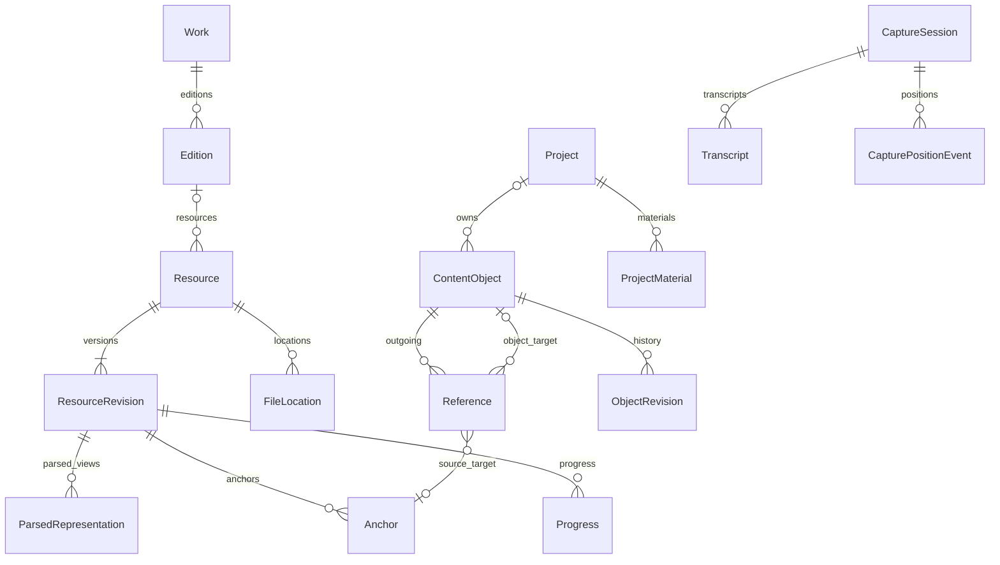

# MANGA 领域模型与数据设计

| 项目 | 内容 |
| --- | --- |
| 文档编号 | DESIGN-MANGA-DATA |
| 版本与日期 | 0.2 / 2026-09-19 |
| 状态 | 评审稿；以下类型表达协议语义，尚非应用源码 |
| 治理与决定 | [文档治理](../governance/documentation-policy.md)；[确认与待决事项](../decisions/open-questions.md)；文档状态不代表实现通过 |
| 对应需求 | LIB、READ、NOTE、VOICE、CTX、CRE、CLIP、DATA 系列 |
| 相关文档 | [总体架构](architecture.md)、[Agent 与插件](agent-and-plugins.md) |

## 1. 建模原则

- 业务 ID 标识对象；路径用于找到文件；内容指纹用于确认版本和重复内容。
- 原始内容、用户记录、AI 派生内容和搜索索引分别保存。
- 来源引用固定资源版本；创作对象的引用明确选择实时或快照语义。
- 所有跨模块引用使用公开身份与定位协议，不能依赖 DOM 节点、组件地址或当前屏幕页码。
- 一个模块拥有自己内容的语义，公共登记层只管理身份、范围、修订、引用和可移植封装。
- 本地作品身份独立于外部数据库。外部 ID、字段候选与用户覆盖分别保存；下载产物沿用标准 Resource/ResourceRevision/FileLocation，不另建与本地库冲突的身份体系。

0.2 新增的 ExternalIdentity、MetadataSnapshot、MetadataFieldSelection、UserMetadataOverride、ProviderInstance、AcquisitionPlan/Job、ArtifactRecord 与 ImportReceipt 由[外部数据库与下载扩展](external-providers-and-acquisition.md)定义。元数据插件停用后基础库仍保存已确认资料、用户覆盖和来源摘要；换源不改变本地进度和锚点。

## 2. 主要实体与关系



图中外部网页和独立素材可以直接成为 Resource，无需强制创建作品与版本。Reference 的目标为锚点或创作对象之一，不能同时指向两者。个人范围的 ContentObject 不属于 Project。

### 2.1 实体职责

| 实体 | 职责与关键字段 |
| --- | --- |
| Work | 一部特定媒介作品的元数据：ID、标题/别名、媒介、关系、来源；小说与改编动画用关系连接 |
| Edition | 同一作品的语言、译本、发行版或资源版本集合；不同译本/剪辑版本可以独立管理 |
| Resource | 可打开的逻辑资源，例如一本书、一卷漫画、一集视频或网页资料；含类型、所属版本、当前修订 |
| ResourceRevision | 不可变的资源内容版本：内容指纹、原始文件清单、稳定源条目身份和原始媒体信息 |
| ParsedRepresentation | 同一原始修订的一种解析表示：解析器版本、规范化规则、结构与位置映射；正文等大体积派生内容可重建 |
| FileLocation | 逻辑资源对应的磁盘位置与校验结果；一个资源可有多个已验证副本 |
| Anchor | 指向某个资源修订内的位置或范围；含定位器、恢复信息和解析状态 |
| Progress | 本地用户在资源修订上的最后位置、已消费区间、完成状态与历史 |
| ContentObject | 笔记、白板、思维导图、粗剪等创作对象的公共封装 |
| Reference | 从创作对象或其局部指向资源锚点或另一对象/局部，表达引用、嵌入与关联 |
| Project / ProjectMaterial | 创作目标、范围、术语与材料引用集合 |
| CaptureSession | 原始录音片段、采集设备信息、时钟映射、内容位置和处理状态 |
| Transcript | 转写原文、分段时间、提供者信息、语言与修订历史 |
| DerivedArtifact | AI 或提取任务的结果与来源：输入引用、配置、生成时间、结果修订 |
| ObjectRevision | 创作对象的历史修订或可恢复检查点，用于差异、冲突与撤销 |

## 3. 身份、范围与版本

### 3.1 公共约定

- ID 使用应用生成的稳定 UUID 或等价无路径标识，跨导出导入尽可能保持。
- 时间点以 UTC 时间保存；录音同步另用单调采集时钟，不能用墙上时间推算媒体进度。
- 创作对象修订 `revision` 是单调递增整数；成功修改后增加。
- `schemaVersion` 表示载荷格式，`resourceRevisionId` 表示原始内容版本，二者不能混用。
- 文件内容指纹、解析器版本与规范化版本共同决定解析表示是否有效；重排页面或升级解析器不会伪造一个原始内容变化。
- 对象的归属范围为个人资源库或一个创作项目。另一个项目通过材料引用复用，不隐式转移所有权。

```ts
type ObjectScope =
  | { kind: 'library' }
  | { kind: 'project'; projectId: string };

interface ContentObject<TPayload = unknown> {
  id: string;
  type: string;                 // notes.document / board.canvas / mindmap.tree 等
  ownerModuleId: string;
  scope: ObjectScope;
  schemaVersion: number;
  revision: number;
  title: string;
  payload: TPayload;
  attachmentIds: string[];      // 公共可枚举清单，支持未知模块备份与导出
  preview: { text?: string; thumbnailAttachmentId?: string };
  createdAt: string;
  updatedAt: string;
  deletedAt?: string;
}
```

公共封装持久保存 payload、预览和附件引用。所有用户附件必须在公共 attachmentIds/附件引用表登记，跨对象引用必须进入公共 reference 表，不能只藏在私有 payload 中。模块停用或未知时，宿主能保留和导出载荷，但不擅自解释或修改其私有结构。

### 3.2 四种变化的不同处理

| 变化 | 处理 |
| --- | --- |
| 文件改名/移动，内容一致 | 更新 FileLocation，业务 ID 和来源版本保持 |
| 文件内容改变 | 产生新 ResourceRevision，已有 Anchor 继续固定旧版本 |
| 笔记正文或白板布局改变 | 增加 ContentObject.revision，按需保存历史与撤销信息 |
| 插件数据结构升级 | 增加 schemaVersion，执行版本迁移并保留迁移前备份 |

## 4. 资源导入与内容版本

### 4.1 导入步骤

1. 用户选择文件或目录，平台层确定允许访问的根与有效路径。
2. 识别资源候选，枚举有限范围的容器条目，探测格式与大小。
3. 使用文件大小、时间等快速信息进行初筛，后台内容指纹确认重复或变化。
4. 建立 Resource 与不可变 ResourceRevision，保存源条目身份；生成 ParsedRepresentation、结构清单与可用性状态。
5. 将已解析段落、页面或字幕片段送入派生索引，保存来源版本与定位器。

快速指纹不能独立证明两个资源完全相同。疑似重复项可以等待完整校验或由用户处理，不能仅以同名文件合并记录。

### 4.2 结构清单

- 小说清单包含正文部件、章节层级、规范化文本规则和源文档位置映射。
- 漫画清单包含稳定页面 ID、原始条目、图像指纹、尺寸、方向和顺序。
- 视频清单包含持续时间、流信息、时间基、起始时间偏移、字幕附件和可选关键帧信息。
- 网页资料保存 URL、获取时间、提取正文、内容指纹与本地快照；后续重新抓取属于新修订。

解析器升级产生新的 ParsedRepresentation；如果新的规范化规则影响文本偏移，需要保留旧规则标识并提供定位转换，不能直接以新偏移覆盖旧锚点。被锚点引用的解析表示元数据、源条目身份和必要位置映射必须保留，不随普通缓存清理删除；大体积解析正文可在相应规则可用时重新生成。

## 5. 来源锚点协议

### 5.1 数据结构

```ts
type SourceLocator =
  | {
      kind: 'text';
      partId: string;
      representationId: string;
      normalizationVersion: string;
      range: { start: number; end: number };
      quote?: { exact: string; prefix?: string; suffix?: string };
      sourceCfi?: string;
    }
  | {
      kind: 'image';
      pageId: string;
      region?: { x: number; y: number; width: number; height: number };
    }
  | {
      kind: 'temporal';
      startMs: number;
      endMs?: number;
      trackId?: string;
    };

interface Anchor {
  id: string;
  resourceId: string;
  resourceRevisionId: string;
  locator: SourceLocator;
  preview?: { text?: string; attachmentId?: string };
  createdAt: string;
}
```

锚点的目标版本不可被后台任务偷偷替换。显式重新定位可以创建新锚点，并记录 `replacesAnchorId` 和修复原因；使用它的引用在确认后迁移。

### 5.2 文本定位

- 内部文本范围使用规范化文本上的 Unicode 码点偏移，采用左闭右开 `[start, end)`；起止相同可表示书签位置。
- DOM、CFI 和内部文本的偏移分别进行转换与测试，避免中文、组合字符和 emoji 造成错位。
- 规范化规则必须版本化，明确换行、空白、隐藏内容与段落分隔处理。
- EPUB CFI 可作为源结构定位信息；渲染清理后的 DOM 通过源映射连接到规范化结构。
- 同时保存适量原文与前后文，用于核对与恢复；出现多个同等匹配时交由用户选择。
- 页码与滚动比例用于显示和快速恢复，不承担永久引用身份。

文本范围和引用片段必须明确定位语义。内部规范化规则独立保存并版本化，不能假设不同格式的偏移编码天然一致。

### 5.3 图像定位

- 页面 ID 由资源清单维护；阅读方向、单双页和重排仅改变展示。
- 区域坐标基于处理原始方向后的完整页面，取值在 `[0, 1]`；宽高为正，区域不超出页面。
- 翻转、缩放、裁边等视图操作要映射回源页面坐标。
- 页面图像重复时，内容指纹可能相同，因此恢复还需要原始条目和邻近清单信息。

### 5.4 媒体定位

- 时间以资源的规范化呈现时间轴表示，单位毫秒；保存底层流起始偏移和时间基用于转换。
- 时间区间采用左闭右开，`endMs > startMs`；点引用可以只保存 startMs。
- 播放倍速不改变来源时间；导出后新文件的时间轴不能直接替代来源时间轴。
- 不同剪辑版、重新编码或片头增减后的文件要重新校验，不能仅因时长相近而自动复用时间锚点。

### 5.5 锚点解析结果

解析接口返回 `resolved`、`needs_review`、`missing_resource`、`missing_revision`、`missing_capability` 或 `unresolved`，并附匹配依据。

顺序为：确认身份与版本 → 验证直接定位 → 使用受限的恢复信息匹配 → 返回精确结果或待确认候选。没有可靠匹配时明确失效，保留记录内容与修复入口。

## 6. 进度与防剧透边界

Progress 至少保存 `resourceId`、`resourceRevisionId`、`lastLocator`、`consumedRanges`、`completionState`、`lastInteractionAt` 和历史修订。

- 小说使用文本部件/区间，漫画使用页面及必要区域，视频使用来源时间区间。
- 阅读展示、播放经过和用户明确标记产生进度；跳转中间的范围不自动计入。
- 完成状态为用户可修正的业务状态，不以打开结尾一次作为唯一判断。
- 进度写入可合并相邻区间，保持足够精度与合理大小；保留明确的版本关联。
- 已读约束和用户设置的防剧透边界分别保存；用户可以主动允许某章或某集内容进入上下文。
- 检索首先按允许资源和允许范围筛选，再排序与摘要；后续材料提取也必须重复检查范围。

## 7. 笔记、白板和思维导图

### 7.1 笔记

笔记 payload 由有序块构成。每个块具有稳定 `blockId`、类型和内容；块 ID 在移动和编辑时保持，在复制时重新生成。首版围绕标题、段落、列表、引用、代码/纯文本和嵌入块实现。

原文摘录、用户评论、转写原文和 AI 整理稿有不同来源标签。用户编辑整理稿形成新修订，后续重跑模型生成候选结果，不能覆盖用户已编辑的版本。

### 7.2 白板

白板 payload 包含卡片、连线、分组和布局。卡片的 occurrence ID 标识本次摆放；其 referenceId 标识所引用的内容。相同笔记可以在白板出现多次，每次有自己的位置和尺寸。

移动卡片只修改白板布局；通过卡片编辑源笔记则调用笔记命令，并更新源笔记修订。两类操作分别进入对应对象的撤销记录。

### 7.3 思维导图

思维导图 payload 包含稳定节点 ID、文本或引用、parentId、同级顺序、折叠状态和布局设置。父子关系必须形成单根树，节点只能有一个结构父节点，不能移入自己的后代。

节点可附加跨对象关联，但这些关联不改变树的父子结构。引用同一材料的两个节点仍是两个独立节点。

### 7.4 引用与嵌入

```ts
type ReferenceTarget =
  | { kind: 'anchor'; anchorId: string }
  | { kind: 'object'; objectId: string; partId?: string };

interface Reference {
  id: string;
  sourceObjectId: string;
  sourcePartId?: string;
  target: ReferenceTarget;
  relation: 'quote' | 'embed' | 'related' | 'material';
  presentation: 'link' | 'card' | 'inline';
  versionPolicy:
    | { kind: 'live' }
    | {
        kind: 'snapshot';
        targetRevision:
          | { kind: 'resource'; resourceRevisionId: string }
          | { kind: 'object'; revision: number };
        snapshotAttachmentId: string;
      };
}
```

来源 Anchor 自身已经固定资源修订；对它选择 live 只表示展示当前解析状态，不允许切换来源版本。创作对象 live 引用展示最新可访问修订，snapshot 展示固定快照。快照的 targetRevision 类型必须与引用目标相符，资源修订 ID 与对象整数修订不能互换。

- 默认嵌入为实时引用，复制通过独立命令创建新对象。
- 公共引用表维护正向与反向关系；对象 payload 引用 referenceId，修改二者在同一事务提交。
- 渲染时传递祖先对象链并设置展开深度，默认最大 3 层；遇到循环显示链接卡片。
- 模块不可用时展示公共预览和来源信息；不执行未知载荷。
- 部分引用跨项目时，需要明确加入当前材料范围；建立链接本身不会扩大 Agent 授权。

## 8. 项目与材料范围

Project 保存名称、目标、状态、术语表引用、默认工作区和默认模型路由覆盖。ProjectMaterial 保存目标资源/锚点/对象、加入时间、标签和排序。

项目材料关联和对象所有权分别维护。删除项目先进入可恢复状态，项目拥有的对象按明确规则归档；外部引用的个人资源和个人笔记不随之删除。

首版没有多用户权限体系，但 Agent 仍有按项目和任务计算的有效范围：用户授权与任务材料范围的交集，并扣除进度、对象状态等限制。

## 9. 语音采集与位置映射

### 9.1 时间数据

CaptureSession 保存采集时钟域、录音起点、音频片段附件、设备选择、采样信息和状态。CapturePositionEvent 记录：

```ts
interface CapturePositionEvent {
  captureOffsetMs: number;       // 相对真实采集起点
  clockDomainId: string;
  resourceId?: string;
  resourceRevisionId?: string;
  locator?: SourceLocator;
  playing?: boolean;
  playbackRate?: number;
  reason: 'start' | 'speech_start' | 'sample' | 'seek' | 'pause'
    | 'resume' | 'rate_change' | 'resource_change' | 'stop';
}
```

音频使用采样偏移或采集时间戳建立映射，不能使用上传完成、音频 chunk 到达或模型返回的时间。跨时钟域时保存校准关系与误差，无法满足精度时允许用户手动修正。

### 9.2 绑定规则

1. 启动录音时立刻记录资源与位置，保证即使没有识别结果也有初始来源。
2. 能进行语音分段时，按片段真实起点建立更准确的引用；没有分段信息时使用录音起点，并明确显示可调整。
3. 播放期间记录定期样本和暂停、跳转、倍速等事件，按分段时间映射来源区间。
4. 同一个连续播放区间可用来源时间起点与倍速插值；遇到跳转或切换资源必须切段。
5. ASR 段落匹配录音偏移，生成一个或多个来源锚点，不把不连续片段合成虚假的连续区间。
6. 小说或漫画定位取该片段的选区/当前位置快照，翻页与资源切换同样产生事件。

### 9.3 原文、整理与修订

录音 → Transcript 原文 → DerivedArtifact 整理候选 → 用户可编辑的笔记。各阶段保存输入和输出关系。

失败与取消不会删除已确认保存的原始片段。重新识别或整理形成新尝试/新修订。按用户设定清理原始音频后，笔记和转写保留来源时间及“录音已清理”的状态，不能继续显示可播放的假入口。

## 10. 粗剪项目

粗剪作为 ContentObject 的一个类型，payload 保存有序 ClipSegment：来源资源与修订、请求区间、排列顺序、备注和引用 ID。首版使用单个串行序列，不引入复杂多轨合成。

导出生成独立 ExportPlan，包含输出容器、流选择、兼容性报告、每段请求区间、计划实际区间和是否重编码。无转码计划必须通过后端探测；不满足时返回明确原因。

导出结果保存实际处理区间、来源到输出的时间映射、输出指纹与任务记录。用户确认的片段标记继续保留原请求值，以免为适应关键帧而失去最初意图。

## 11. SQLite 与文件存储

### 11.1 建议逻辑表

| 分组 | 表/集合 | 数据性质 |
| --- | --- | --- |
| 资源 | work、edition、resource、resource_revision、file_location、progress | 权威业务数据 |
| 解析元数据 | parsed_representation 与被引用的位置映射 | 需保留的定位元数据；大体积派生正文与可重建缓存分开 |
| 内容 | content_object、object_revision、anchor、reference | 权威业务数据 |
| 项目 | project、project_material | 权威业务数据 |
| 采集 | capture_session、capture_position_event、transcript、derived_artifact | 原始记录与明确来源的派生结果 |
| 运行 | agent_session、agent_run、job、job_attempt、operation、domain_event | 运行恢复与审计 |
| 配置 | module_config、provider_connection、model_profile、task_binding | 不含明文凭据的配置 |
| 附件 | attachment、attachment_reference | 文件身份与引用关系 |
| 索引 | text_fragment、fts_index、embedding_index_metadata | 可重建投影 |

创作对象的规范载荷初期可以保存在 content_object 的版本化 JSON 中，附件另存文件；文本块和检索关系建立派生投影。以后迁移为规范化子表时，保持公共对象和导出格式兼容。

reference 是权威关系表，载荷仅保存关联 ID。对象修订和关系变化在统一事务内提交。列表查询只读取摘要，不加载所有大载荷。

### 11.2 文件分区

- `data`：数据库与配置元数据。
- `attachments`：用户录音、用户附图、原始引用快照与其他不可随意丢弃的附件。
- `cache`：缩略图、可重建 OCR/解析缓存和临时预览。
- `jobs`：尚未完成的导出临时文件与检查点。
- `backups`：用户触发或策略生成的备份。

这些目录通过平台数据目录接口确定，不硬编码磁盘盘符。托管媒体与外部媒体分别记录位置。附件清理按引用关系、任务状态和用户保留策略执行。

## 12. 资料包、备份与迁移

### 12.1 可移植资料包

`.manga-bundle` 是带 manifest 的容器，初始版本为 `bundleVersion: 1`，可表示选择内容或完整项目。逻辑内容为：

```text
manifest.json                 包版本、kind、根对象、模块格式与文件校验清单
objects/                      创作对象封装与必要历史/固定快照
references.json               正反关系所需的引用记录
sources.json                  资源身份、修订、锚点与文件指纹
representations/              被引用的解析表示元数据与必要位置映射
scopes.json                   对象归属所需的最小范围描述
provenance/                   必要转写原文、采集位置与派生结果的来源关系
progress.json                 用户选择导出的进度
attachments/                  必要附件与用户选择附带的媒体
project.json                  kind=project 时的项目和材料集合
```

导出闭包包含维持根对象引用所需的目标身份、锚点、定位元数据、快照及必要派生依据。对语音笔记，按输出对象/修订关系纳入转写原文和来源时间；是否附带原始音频由用户选择，未附带时保留明确状态。跨项目对象至少携带所需范围描述；是否展开为完整目标内容由导出选择决定，不自动打包整个关联项目。未包含的实时目标以可识别的引用描述保留。可以不附带大型媒体，但必须保留缺失媒体的描述与重新定位依据。固定快照和用户生成附件默认纳入闭包。

- 包内只使用安全相对路径和内容清单，不把绝对路径当作跨设备定位依据。
- 普通资料包不包含凭据和完整会话私密历史；是否附带材料和录音由导出范围决定。
- 导入先校验格式、大小、路径和指纹，再暂存与预览，最后事务性提交元数据。
- 相同 ID、相同内容可以合并；相同 ID、不同修订不能静默覆盖，需保留分支或重新映射并同步修改所有引用。
- 未知模块对象按原封装保留，可以查看预览和再次导出。

### 12.2 备份与恢复

备份保存一致数据库快照、模块配置和被引用的用户附件。外部媒体可以单独备份或保留位置描述，界面明确覆盖范围。凭据由系统凭据存储管理，恢复后按需重新绑定。

恢复在隔离暂存位置检查，成功后再切换；失败时保留现有工作数据。完整恢复与“把资料包导入当前库”是两种不同操作。

### 12.3 数据迁移

全局数据库结构版本、模块 schemaVersion、文本规范化版本和索引版本分别维护。每次升级声明输入/输出版本和验证规则，升级前生成备份；迁移失败不会将半成品视为成功。

重构可以替换代码与内部存储，但需要通过样本包验证 ID、引用、进度和用户内容的保留。无法自动迁移的内容进入明确的只读恢复流程。

## 13. 导航与失效引用

内部导航使用 `openReference(referenceId)` 或目标句柄，由宿主查找对应模块并打开。外部深链接只携带经过校验的逻辑 ID，经路由重新校验资源与范围，不能包含可执行命令或获得任意磁盘访问权。

独立应用通过相同目标协议与资料包恢复引用；具体 URL scheme 属于宿主，不写入领域对象作为唯一身份。

失效引用应保留标题、类型、原始摘录或缩略图、失效原因和修复入口。源对象被放入回收站时可以恢复；永久删除前需展示受影响引用，删除后维持可识别的失效记录。

## 14. 关键数据用例

- 同一本书改变字号后，从笔记跳回同一句文本。
- CBZ 内页面顺序变化后，旧引用维持旧修订，修复时按页面身份核对。
- 录音跨暂停、两倍速与跳转，生成分别对应正确来源的片段引用。
- 同一笔记在两个白板出现，修改源文更新两个视图，移动一张卡片不改变另一张的位置。
- 导出包含循环关系的对象集合，在未知模块环境导入后仍可完整再次导出。
- 替换嵌入模型后重建索引，原始正文、笔记和锚点保持可用。

这些用例的验收门槛由[交付与验收文档](../delivery/roadmap-and-acceptance.md)定义，实际执行状态由[执行台账](../delivery/status.md)链接证据。
