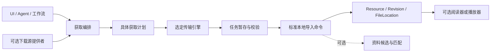

# MANGA 外部动漫数据库与下载扩展设计

| 项目 | 内容 |
| --- | --- |
| 文档编号 | DESIGN-MANGA-PROVIDERS |
| 版本与日期 | 0.2 / 2026-09-19 |
| 状态 | 评审稿；接口与配置均为拟议契约，未实现或完成站点验证 |
| 治理与决定 | [文档治理](../governance/documentation-policy.md)；[确认与待决事项](../decisions/open-questions.md)；文档状态不代表实现通过 |
| 上位方案 | [可组合与 AI-Native 架构](composable-ai-native-architecture.md) |
| 关联协议 | [领域模型](domain-model.md)、[Agent 与插件](agent-and-plugins.md)、[交付验收](../delivery/roadmap-and-acceptance.md) |

## 1. 设计目标与边界

外部动漫数据库负责提供作品资料，下载源负责发现可获取资源，传输引擎负责取得字节，本地资源库负责校验导入与长期管理。这四项责任分别有契约、配置、生命周期和数据所有者，可以独立替换，也可以由一个发行包提供多个实现。

本地资源库在不安装任何在线插件时仍可导入、阅读、编辑资料和保存进度。所有外部能力均可选；已经导入的文件和本地身份不依赖来源网站持续存在。

本文中 Bangumi、AniList、HTTP 等名称用于说明适配方向。第一批真实服务的接口覆盖、认证、限流、缓存与使用条款需要在发布前验证，不能因为字段名字相似就宣称兼容所有站点。

## 2. 能力定义、提供者与消费者

| 能力契约 | 提供者示例 | 消费者 | 组合方式 |
| --- | --- | --- | --- |
| `manga.metadata.provider` | 数据库 A、数据库 B、本地用户资料包 | `metadata.catalog` | 搜索聚合、关联匹配、字段选择 |
| `manga.acquisition.source` | 授权资源 API、用户指定下载目录/链接来源 | `acquisition` | 来源选择、发行项与资源清单 |
| `manga.transfer.engine` | 宿主 HTTP 传输、受控外部下载器适配 | `acquisition` | 按协议和任务要求绑定一个引擎 |
| `manga.library.import` | 本地资源导入模块 | UI、Agent、下载导入桥接 | 所有来源复用同一校验导入流程 |

业务消费者依赖这些契约，不依赖 `metadata-bangumi` 或某个下载器的实现。某网站同时提供资料与下载时，分别注册两种能力；用户可以只授权资料查询。

## 3. 元数据提供者协议

### 3.1 最小可替换接口

以下 TypeScript 只表达协议形状。`JsonValue`、`InvocationContext`、Page 与候选 schema 由 SDK 定义；跨进程时 Context 转换为经过验证的调用封装，取消使用 RPC 取消消息，不能序列化函数或直接传递 AbortSignal。

```ts
interface MetadataProvider {
  describe(): MetadataProviderDescriptor;
  search(input: MetadataSearch, ctx: InvocationContext): Promise<MetadataSearchPage>;
  get(input: ExternalSubjectRef, ctx: InvocationContext): Promise<SubjectSnapshot>;
}

interface ExternalSubjectRef {
  namespace: string;       // 站点/数据集身份，例如 bangumi:subject
  externalId: string;      // 保留原始字符串，不能假设所有来源都是整数
  entityKind: string;      // work、season、episode、person 等已声明类型
}

interface MetadataProviderDescriptor {
  apiVersion: string;
  instanceId: string;      // 具体连接/账户实例，不是站点记录的永久身份
  namespaces: string[];
  mediaKinds: string[];
  supportedFields: string[];
  supports: {
    search: boolean;
    lookup: boolean;
    relations: boolean;
    episodes: boolean;
  };
}

interface FieldCandidate {
  field: string;
  value: JsonValue;
  language?: string;
  source: ExternalSubjectRef;
  providerInstanceId: string;
  snapshotId: string;
  retrievedAt: string;
  sourceUpdatedAt?: string;
  sourceUrl?: string;
  attribution?: string;
}
```

默认提供者实现只读查询。远程收藏、评分或进度同步属于独立写入能力与工作流，不能因为查询插件有凭据就自动获得这些功能。

提供者返回来源事实和候选映射，不直接更新 Work、用户收藏或本地进度。归一化只转换已定义字段、日期、语言和媒介枚举；站点特有字段放入命名空间扩展区，保留来源，不能静默丢失或冒充公共字段。

### 3.2 查询、缓存与错误

- 搜索结果使用提供者自有游标并带来源；聚合器持有每个实例的游标，不能把不同站点分页拼成一个未经定义的页码。
- 请求具备超时、取消、并发上限、重试预算和限流信息。错误区分认证失败、限流、不可用、未找到、格式不兼容和权限不足。
- 缓存 key 包含 namespace、实例/账户可见性范围、语言、请求参数与接口版本；私人列表不能复用公共缓存。
- 尊重条件请求、过期策略和站点缓存要求。断网时可返回已缓存快照，并明确来源与抓取时间。
- 一个源失败时返回 `partial` 状态、成功源结果和失败原因；只有明确的空结果才是“未找到”。
- 故障熔断与指数退避有上限；用户刷新不绕过服务限流。提供者停用后不再联网，保留已合法保存的本地来源记录。

## 4. 本地作品身份与字段所有权

### 4.1 数据扩展

| 实体 | 所有者与关键字段 | 作用 |
| --- | --- | --- |
| Work / Edition | `library.catalog`；沿用现有本地 ID | 作品与发行版本身份，不依赖在线源 |
| ExternalIdentity | `metadata.catalog`；本地目标、namespace、externalId、entityKind、关联状态、匹配依据 | 将外部记录关联到本地对象 |
| MetadataSnapshot | `metadata.catalog`；外部身份、抓取时间、字段、来源版本/摘要、缓存策略 | 保存某次来源事实；原始响应按许可与保留策略选存 |
| MetadataFieldSelection | `metadata.catalog`；workId、field、候选引用、策略版本、选择原因、revision | 当前有效字段的可解释投影 |
| UserMetadataOverride | `library.catalog`；字段、值/显式清空、锁定状态、revision | 用户意图优先，关闭元数据插件后仍可管理 |
| ProviderInstance | 提供者配置服务；moduleId、实例 ID、配置、credentialRef、状态 | 同一提供者可有不同账户或配置 |

ExternalIdentity 使用独立 link ID；同一外部记录可能对应复合条目，不能强制它与本地 Work 一对一。`same-entity`、`contains`、`adaptation-of` 等关系分别表达，人工确认的多个本地对象不因命中同一站点页面自动合并。

基础库保存最近一次确认的有效资料及通用来源摘要；停用 `metadata.catalog` 后仍能浏览这些资料和编辑用户覆盖。重新启用时重新计算投影，不能丢弃期间的用户修改。备份包含关联、候选与选择信息，不依赖重新访问网站。

### 4.2 匹配流程

1. 从本地文件名、现有标题、媒介、语言、发行信息和用户选择形成查询线索；文件名只是证据之一。
2. 对选定源搜索，得到保持各自身份的候选。显式跨站 ID 映射可以增加证据，但仍检查媒介与条目类型。
3. 综合标题别名、媒介、年份/日期、季/卷/集结构和发行信息进行匹配，保留规则版本与证据。
4. 歧义候选进入待确认。动画改编与漫画、第一季与续季、TV 与剧场版、正篇与特别篇不得仅因名称相似而合并。
5. 确认关联后才为对应本地对象选用字段；修改关联提供预览，记录原关联和受影响字段。

M1/M2 默认采用“候选→人工确认”流程。高置信自动匹配是可选策略，需要在标注样本上测量误匹配率并定稿阈值，不能直接信任不同站点返回的不可比 confidence。AI 可解释候选差异或提出关联建议，最终仍经过相同业务命令。

### 4.3 多源组合规则

| 策略 | 适用行为 | 约束 |
| --- | --- | --- |
| single | 仅使用选定来源 | 明确最简单且可预测的配置 |
| fallback | 主源缺失、不可用或超时后查询允许的备选 | 区分无字段与故障；不能覆盖用户锁定值 |
| federated-search | 并发查询多个来源，聚合候选 | 只对已确认身份去重，未匹配结果保留来源 |
| field-merge | 同一已确认本地对象按字段规则选择 | 标量择一；集合按定义归并；保留全部候选与原因 |

合并优先级默认为：**用户覆盖/锁定 → 用户指定字段来源 → Profile 的字段策略 → 已有已确认值 → 未填字段保持未知。** 用户可以采用新的候选，但一次自动刷新不能覆盖用户覆盖值。

字段处理不能只有 `Object.assign()`：

- 标题按语言分别选择；别名可按语言及规范化规则去重并保留原文。
- 简介是一整段带语言和来源的文本，不能把不同源的段落静默拼成一篇。
- 评分保留站点、量纲、样本数与时间，不直接平均 8/10 与 80/100。综合评分如有需要，作为另一个显式派生插件。
- 放送日期包含精度与时区语义；只有年份的字段不能补成虚假的 1 月 1 日。
- 集数区分预计、已播、正篇与特别篇，不直接取最大值。冲突提供比较入口。
- 海报和图片保留来源与使用信息，下载图片也通过受控网络与附件服务；不把远程 URL 当作永久可用文件。
- `missing`、`unknown` 与明确的删除/清空不同。源暂时漏字段不得擦除本地已有信息。

示例：中文标题优先数据库 A，原文标题与发行日期优先 B，用户锁定封面 C。A 超时只使中文标题刷新失败，保留旧标题；不会清空 Work，也不会把 B 的外部 ID 替换成本地主键。

### 4.4 换源过程

选中新绑定 → 校验接口与凭据 → 展示关联和字段差异 → 在用户授权范围内应用 → 增加策略/选择修订 → 重建受影响投影。

新源不能匹配的对象保持原有本地资料并标为待关联。旧源关闭后停止刷新，但其来源快照依保留规则继续可读；删除来源历史是独立数据操作。换源不改 ResourceRevision、Anchor 或 Progress，不触发媒体重新导入。

## 5. 下载扩展的职责划分



### 5.1 下载源与传输引擎

下载源发现发行项、文件清单与可获取描述；传输引擎处理字节、进度、重试和断点。下载源不直接写库，传输引擎不认识 WorkId 的业务含义。用户提供的直接链接也可以作为一种简单来源，无需先匹配外部数据库。

```ts
interface AcquisitionSource {
  search(input: AcquisitionSearch, ctx: InvocationContext): Promise<ReleasePage>;
  resolve(input: ReleaseRef, ctx: InvocationContext): Promise<AcquisitionOffer>;
}

interface AcquisitionOffer {
  offerId: string;
  sourceInstanceId: string;
  expiresAt?: string;
  mediaHints: JsonValue;
  files: Array<{ entryId: string; name: string; expectedSize?: number; checksum?: string }>;
  transport: {
    protocol: string;
    requestHandle: string; // 宿主托管的敏感传输描述，不把签名 URL/认证头暴露给 Agent
  };
}

interface TransferEngine {
  describe(): TransferCapabilities;
  start(spec: TransferSpec, ctx: InvocationContext): Promise<TransferJobRef>;
  status(job: TransferJobRef, ctx: InvocationContext): Promise<TransferStatus>;
  cancel(job: TransferJobRef, ctx: InvocationContext): Promise<void>;
}
```

`TransferCapabilities` 明确协议、暂停、续传、限速和校验支持。暂停/恢复是独立可选接口；无续传能力就明确显示只能重下，不能所有下载器都被假设支持。模型不能伪造 requestHandle；敏感 URL、Cookie、认证头由凭据/网络 broker 管理，普通日志仅保留脱敏来源。

初期建议受控 HTTP 传输验证端到端流程。BT、网盘、外部下载器以及不同来源认证属于后续独立适配器，不将它们内置到本地资源模型。

### 5.2 两步获取命令

`acquisition.plan` 产生具体计划：来源实例、发行项、文件清单、已知总大小、目标目录句柄、冲突策略、费用（如有）、导入方式与可恢复能力。未知大小应明确显示，并有配置的配额。

`acquisition.start` 提交计划 ID、预期计划版本与幂等键。宿主验证计划未过期、来源仍启用、目标授权、剩余空间与费用/网络范围。用户已经明确选择并授权的任务直接执行；更换目标、扩大下载清单或产生新费用则属于需要重新校验的计划变化。

目标路径由宿主授予目录句柄和生成安全文件名。提供者返回的名称不得成为任意磁盘路径；下载后文件经过标准容器和格式检查，下载成功不意味着格式可信或一定可阅读。

## 6. 下载、文件与数据库的一致性

### 6.1 任务状态与持久记录

保持既有统一 Job 状态 `queued/running/waiting_input/succeeded/failed/cancelled/interrupted`。下载模块在独立 `phase` 中记录 resolving、transferring、verifying、publishing、importing 等阶段；不要引入与 Job 含义冲突的第二套成功状态。用户暂停时 Job 为 waiting_input，保存原因 `user_paused` 与断点。

| 记录 | 关键内容 |
| --- | --- |
| AcquisitionPlan | 计划版本、源/发行项、文件清单、目标句柄、许可范围与过期时间 |
| AcquisitionJob | 统一 jobId、阶段、源/引擎版本与实例、绑定 epoch、幂等键、检查点 |
| ArtifactRecord | entryId、暂存句柄、目标位置、字节数、指纹、校验结果、发布状态 |
| ImportReceipt | 入库幂等键、ResourceId/RevisionId、导入命令结果、来源记录 |

一项工作流可以包含多个子任务；UI 区分“文件已下载”和“已加入资源库”。下载完成但导入失败时保留已校验产物并提供重试导入，不重复下载。

### 6.2 文件提交协议

文件系统与 SQLite 不具备共同事务，必须用可核查日志收敛：

1. **登记意图**：先持久化 Job 与 ArtifactRecord，分配任务专属暂存位置和目标授权，禁止覆盖未在计划中列出的文件。
2. **下载**：写入 `.partial` 暂存文件，保存字节数、ETag/Last-Modified 或引擎断点；续传前验证远端版本，变化则重新下载。
3. **校验**：验证长度、已知来源校验和、内容指纹与可接受格式；记录 verified。自行计算哈希只能确认本地产物一致性，不等于来源真实性证明。
4. **发布准备**：持久化预期目标和指纹，使用宿主原子“不覆盖”发布原语。跨卷时先复制到目标卷临时文件、刷盘并核验，再发布；不能把跨卷 move 当作原子事务。
5. **发布确认**：记录目标文件已发布。若进程在发布与记录之间崩溃，恢复器按目标句柄和指纹核查；匹配则补记，冲突则等待用户处理，不能盲目重复或覆盖。
6. **导入提交**：调用标准导入命令，以 `jobId + entryId + 内容指纹` 作为逻辑幂等依据；建立或复用资源修订、文件位置和来源，并在同一数据库事务保存 ImportReceipt。
7. **完成与清理**：全部要求的产物和导入回执到位后才标记逻辑工作流成功，按保留策略清理暂存。数据库提交与磁盘持久化的实测保证须在 POC-09 记录。

相同内容是否归为同一 Edition/Work 是业务判断；指纹去重只避免相同字节被错误重复处理，不自动合并不同译本、作品或用户刻意保留的副本。多文件包逐项记录结果，批量部分失败保留成功项。

### 6.3 取消、禁用和更换引擎

取消请求是意图，只有引擎确认停止且检查点落盘才报告 cancelled。已开始发布或导入的短临界区先完成核查/提交，再停止后续步骤。已入库文件不因取消整个任务自动删除。

停用获取功能时，按主方案停止准入、排空短事务、取消/暂停任务并保存检查点。无法确认外部下载器已停止时显示 interrupted/仍在核查，不能把界面关闭当作停止成功。

下载源关闭后，是否可以完成已经解析的传输取决于事先声明的依赖与授权策略：若阶段不再依赖来源代码且既有授权仍有效，可由已授权传输任务完成；若用户请求停止整个获取功能，则一并停止。设置影响预览必须说明区别。

断点含引擎类型、版本与数据格式。换引擎不假设能读取另一实现的断点；仅在兼容协议验证通过时迁移，否则保留可校验部分并提示从头开始。签名链接过期需要已启用来源重新解析；缺失插件时任务等待恢复，不自动安装它。

## 7. 权限与网络的具体边界

| 授权 | 约束 |
| --- | --- |
| 元数据查询 | 指定域名/接口和必要查询字段；不附带媒体内容或整库路径 |
| 下载网络 | 计划中的来源与允许的跳转目标；重定向重新校验域名、地址与凭据发送规则 |
| 文件写入 | 用户批准的目标目录句柄、任务暂存区域与配额；检查路径穿越、符号链接和重解析点 |
| 资源导入 | 仅将指定产物登记入库；不额外授权重命名/删除用户其他文件 |
| 凭据 | 指定用途与来源实例；第三方 UI、Agent 上下文和普通日志不能读回密钥 |
| 外部下载器 | 显式配置的程序/受控 RPC、任务句柄和可验证状态；不拼接 shell 字符串 |

宿主 broker 应检查 DNS 解析结果与重定向目标，拒绝未经授权访问本机/私网服务，防止外部来源把任意 URL 变成宿主内部网络访问。用户明确配置的本地服务可获独立授权。对远端变更、过期凭据、磁盘不足、下载配额与解压膨胀分别提供可解释错误。

仅通过配置声明权限不构成隔离。受信任内置插件仍受业务网关约束，任意第三方执行代码的实际限制按主方案 M4 门槛验收。

## 8. 面向用户和 Agent 的共同命令

| 命令 | 语义 | 典型结果 |
| --- | --- | --- |
| `metadata.search` | 在指定已授权源查找作品 | 带来源的候选、部分失败信息 |
| `metadata.planLink` | 为本地对象生成关联与字段选择预览 | planId、匹配依据、差异 |
| `metadata.applyLink` | 校验目标修订并应用关联/字段选择 | 新修订、来源、实际变更 |
| `metadata.refresh` | 按绑定策略获取新候选 | 已更新/待确认/未变化/失败 |
| `acquisition.search` | 查找可获取发行项 | 来源与文件摘要 |
| `acquisition.plan` | 固定具体获取目标与副作用 | 获取计划与资源预算 |
| `acquisition.start` | 启动已校验计划 | jobId |
| `jobs.get` / `jobs.cancel` | 通用查看/停止 | 真实任务状态与已有产物 |
| `library.import` | 导入用户文件或已验证下载产物 | Resource/Revision 与来源回执 |

这些命令按安装与启用状态发现。仅安装元数据源时，Agent 不会获得下载工具。Agent 请求“用 A 补中文标题、B 补放送信息”可转为字段策略草案和实际对象差异；站点资料中出现的命令不能修改权限或控制工作流。

## 9. 验收与故障样本

以下用例纳入[交付计划](../delivery/roadmap-and-acceptance.md)；目前均未执行。

| 用例 | 最小场景 | 必须观察的结果 |
| --- | --- | --- |
| AT-39 | A/B 标题、语言、日期、集数与评分冲突；存在用户锁定值 | 合并符合字段规则；来源可追溯；锁定值不被覆盖；评分不直接平均 |
| AT-40 | A 限流，B 成功，随后全部断网、禁用源、重启 | 返回 partial；本地缓存和确认资料可用；无自动扩大网络访问 |
| AT-41 | 换源且仅部分记录可匹配，包含同名、续季和跨媒介作品 | 本地 ID、文件、进度和锚点不变；歧义不自动合并 |
| AT-42 | 在纯本地 Profile 后装获取组合，再关闭阅读器执行下载导入 | 获取与阅读独立；导入复用标准命令；卸载下载组合后资源仍可打开 |
| AT-43 | 下载/发布/入库各边界崩溃或重复回调；跨卷、同名文件冲突 | 回执幂等、文件不误覆盖、重复恢复不重复入库，已下载未入库可恢复 |
| AT-46 | 传输中关闭来源/获取功能，远端 ETag 改变，换不兼容引擎 | 按实际依赖处理；取消状态真实；续传校验失败不拼接不同版本 |
| AT-47 | 恶意 URL 重定向、越界文件名、凭据回显与超额大小 | broker 阻止越权，日志脱敏，原有用户文件不被修改 |

POC-08 使用本地固定假数据库，POC-09 使用受控 HTTP 服务与临时目标目录，不需要真实付费模型或第三方内容。真实站点适配只在接口契约测试通过后声明支持；至少记录适配器版本、样本、响应变化、限流和认证恢复结果。
