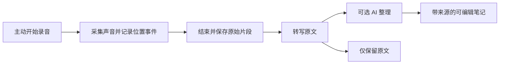

# MANGA 界面与工作流设计

| 项目 | 内容 |
| --- | --- |
| 文档编号 | DESIGN-MANGA-UX |
| 版本与日期 | 0.2 / 2026-09-19 |
| 状态 | 交互评审稿；视觉数值为初始设计参数 |
| 治理与决定 | [文档治理](../governance/documentation-policy.md)；[确认与待决事项](../decisions/open-questions.md)；文档状态不代表实现通过 |
| 输入 | [产品需求](../product/requirements.md)、[领域模型](domain-model.md)、[Agent 协议](agent-and-plugins.md) |

## 1. 交互原则

1. 内容位于主面板，导航与 Agent 作为可收起的辅助区域。
2. 阅读、记录和创作的切换保留正在进行的工作。
3. 记录先明确保存到哪里、引用哪里，再提供智能整理。
4. Agent 展示使用材料和结果去向，用户可以控制任务与撤销修改。
5. 失败保留已完成的工作，并给出可以继续操作的恢复入口。

## 2. 应用壳与三栏布局

### 2.1 默认结构

```text
┌──────────────────────────────────────────────────────────────────────────┐
│ MANGA  模式切换     当前项目/工作区       命令入口       任务与录音状态    │
├───────────────┬─────────────────────────────────┬────────────────────────┤
│ 资源 / 项目   │ 内容标签页                      │ Agent                  │
│ 最近          ├─────────────────────────────────┤ 上下文与来源           │
│ 笔记          │                                 │                        │
│ 白板          │            主面板               │ 会话 / 当前任务        │
│ 思维导图      │                                 │                        │
│ 粗剪          │ 阅读、观看、编辑或组织材料       │ 结果、引用与操作       │
│               │                                 │                        │
│ 设置 / 模块   │                                 │ 输入与任务控制         │
└───────────────┴─────────────────────────────────┴────────────────────────┘
```

页面入口按模式和启用模块动态显示。M1 尚未交付的功能不显示成可以使用的空页面。

### 2.2 尺寸与响应

| 区域 | 初始建议 | 行为 |
| --- | --- | --- |
| 左栏 | 默认 224 px，可调约 200—280 px | 可折叠为约 56 px 图标栏或完全隐藏 |
| 主面板 | 优先分配剩余宽度，阅读/编辑目标宽度至少 640 px | 宽屏可分屏，正文行宽另设上限 |
| 右栏 | 默认 360 px，可调约 320—480 px | 可隐藏，小窗口采用抽屉 |
| 顶部壳 | 紧凑标题与任务区域 | 专注状态可收起，退出入口和快捷键仍可访问 |

初始最小窗口按 960 × 640 px 验证。宽度不足以同时满足三栏和间距时，先折叠左栏，再将右栏转为覆盖抽屉。具体断点按实际可用宽度计算，不通过无限压缩正文来维持三栏。

专注状态仅保留主面板及必要的可唤回控制。左右栏、顶部壳、面板宽度与分屏分别保存为用户布局偏好；模式可有不同布局。

### 2.3 显示状态与业务状态

- 隐藏 Agent 不取消正在进行的任务；全局任务入口可查看和停止。
- 隐藏导航不卸载模块；切换标签不自动清空草稿。
- 播放和录音会话由业务服务持有。是否在切换内容时暂停由用户偏好决定，并显示实际状态。
- 模式切换调整导航和默认建议，已经打开的内容仍保留，包括从另一模式打开的页面。

## 3. 视觉与可访问性

### 3.1 初始视觉参数

| 用途 | 建议值 |
| --- | --- |
| 应用背景 | `#FBFAFC` |
| 面板表面 | `#FFFFFF` |
| 次级背景 | `#F2F0F4` |
| 分隔线 | `#DAD5DF` |
| 主文字 | `#29232F` |
| 次级文字 | `#665E6E` |
| 主要强调色 | `#A83267` |
| 轻量强调背景 | `#FBE7F0` |
| 危险操作文字 | `#B42318` |

粉色用于主要动作、选中、焦点和少量状态提示；正文与长时间阅读以深色文字和稳定背景为主。阅读器可以单独调整背景、字体和行宽，不改变应用壳的品牌主题。

正文对比度目标至少 4.5:1，关键控件边界和焦点需清楚可见；浅分隔线只能用于装饰，不承担唯一的控件边界。状态同时提供文字或图标，不只依赖颜色。

### 3.2 键盘与输入

- 命令面板、资源导航、笔记编辑、引用跳转、录音和任务停止都提供键盘路径。
- 焦点移动顺序与视觉顺序一致，抽屉/弹窗有明确的进入、退出和焦点恢复。
- 中文输入法组合期间不提交段落、不触发快捷命令，也不破坏选区。
- 快捷键可配置，避免覆盖输入框、阅读翻页和系统快捷键。
- Esc 关闭临时浮层，不能无提示地丢弃已录音频或编辑草稿。
- 动画保持轻量，尊重减少动态效果偏好；大列表、画布和内容页面采用渐进加载。

## 4. 信息架构

### 4.1 爱好者导航

最近 → 资源库 → 小说/漫画/动画 → 收藏与进度 → 记录 → 搜索。

资源详情展示作品与版本、文件可用状态、卷章/集、最后位置、相关记录和引用。进度以用户能理解的章节、页、时间和完成状态显示。

### 4.2 创作者导航

项目 → 材料 → 笔记 → 白板 → 思维导图 → 文案 → 粗剪。

项目首页展示目标、最近对象、材料来源、未处理记录与任务。个人资源可以从材料入口加入，已有笔记默认以引用方式加入项目。

### 4.3 设置

设置按用户任务组织为：外观与阅读、声音与录音、AI 功能与模型、模块、资源与存储、备份与导出、快捷键。

AI 配置采用“功能使用什么模型”的视图；连接地址、凭据和高级参数位于可展开配置。界面显示测试结果及缺失能力，不要求用户理解内部工具注册或 IPC。

## 5. 页面上下文交互

### 5.1 上下文栏

Agent 顶部用材料卡片显示当前准备使用的内容，例如：

- 《某小说》第二章，已选 128 字。
- 第 4 集，12:30，字幕范围 12:20—12:40。
- 当前漫画第 18 页，选中一个画面区域。
- 项目“角色关系整理”，已加入 3 条笔记。

用户可展开查看来源范围、移除某项材料或固定材料。没有截图/OCR/字幕时，界面如实显示可用信息，不以“已理解画面”代替实际提取状态。

### 5.2 跟随焦点与固定任务

默认准备区域跟随当前焦点，但发送任务时固定一次上下文。任务运行中切换页面，显示“此任务仍使用发送时的材料”；下一次消息是否改用当前焦点，由新的上下文栏明确呈现。

固定材料会持续出现在后续输入准备区，用户可以解除。切换项目时提示会话范围变化，既有任务保持原范围，不把其他项目的材料静默加入。

### 5.3 结果的落点

Agent 创建结果后展示对象卡片和位置，例如“已保存到个人笔记”或“已加入项目材料”。修改对象时显示目标名称、差异入口与撤销；目标版本变化则保留建议稿并提供比较。

## 6. 工作流 A：导入、阅读与带来源笔记

1. 用户选择文件或目录，导入面板展示识别结果、资源类型、重复项与失败项。
2. 默认索引原位置，托管复制作为明确选项；目录导入可以取消并保留已成功条目。
3. 打开小说后展示目录、进度、阅读设置和查找；正文选区触发轻量操作栏。
4. 选择“记录”后打开就近输入区域，显示来源片段和保存范围。
5. 输入正文或开始语音记录；保存时展示“保存中/已保存”，完成后提供笔记入口。
6. 从笔记点击来源，定位到原文并突出目标；用户可返回原来的笔记位置。

空库显示导入入口和本地使用说明。没有 AI 配置时仍可阅读和创建人工记录，智能功能入口说明所需配置。

## 7. 工作流 B：口述感想与异步整理



### 7.1 采集界面

- 初次使用选择麦克风，并清楚显示当前输入设备。
- 录音时显示持续时间、输入活动和停止入口；波形只表示有输入，不能替代真实录音状态。
- 播放器可按设置在录音时降低音量或暂停；变化反馈明确，结束后恢复原设置。
- 用户切换页面或资源时继续记录位置事件，录音的来源不会被最后打开页面覆盖。

### 7.2 整理界面

状态依次表现为“已保存录音”“正在转写”“原文可用”“正在整理”“笔记已保存”。用户可以在整理期间查看原文和来源。

笔记同时保留原文入口、整理稿、引用位置和可选录音回放。专有名词修改可以保存到项目术语表，但只有用户确认的修改才成为术语。

### 7.3 失败与取消

| 情况 | 显示与恢复 |
| --- | --- |
| 麦克风拒绝访问/不存在 | 显示设备问题与设置入口，不显示虚假的录音计时 |
| 外放对白被误收录 | 允许修改原文/删除片段，提供耳机、降低播放音量和采集设置入口 |
| ASR 失败 | 保留录音和位置，重试或手动输入 |
| 整理失败 | 原文可用，允许稍后重试整理 |
| 用户取消处理 | 保留已保存记录，显示已停止阶段；需要确认清理音频时另行操作 |
| 来源定位不准 | 用户调整来源点/范围，保存修订记录 |

回声消除有设备与实现差异，交互上不使用“保证只录到本人”之类绝对表述。

## 8. 工作流 C：素材整理与互嵌

1. 从记录列表选择材料，加入项目；默认创建引用关系。
2. 拖到白板上生成来源卡片，显示标题、摘要和来源标记。
3. 对卡片进行移动、分组、连线或打开源内容。
4. 将材料加入思维导图节点，调整层级与顺序。
5. 在笔记中嵌入白板、导图或局部节点，通过展开和跳转查看。

嵌入卡片的菜单明确区分“打开源内容”“编辑源内容”“固定为快照”“复制一份”。编辑源内容时标注可能在其他引用位置同步更新。

循环嵌入或超出展开深度时显示可跳转卡片；模块停用时显示可读预览和启用入口。无效引用提供原信息与修复操作，不能仅留下空白区域。

## 9. 工作流 D：文案与资料搜寻

### 9.1 资料搜寻

用户输入检索意图，先查看本地材料；需要外部信息时启用已配置的检索连接。结果显示标题、来源、获取时间和片段，可以加入项目、建立引用或继续阅读。

保存材料时允许选择只记录链接、保留正文片段或保存允许获取的本地快照。来源版本变化后保留已有快照，并提供更新为新版本的选项。

### 9.2 文案生成与修改

用户选择目标文档/选区、使用材料与修改意图，Agent 返回提纲、候选稿或差异。用户可以整段采用、局部采用、继续修改或撤销。

文案界面保留材料引用。缺少来源支持的陈述以待核实内容呈现，生成文本不冒充原始引文。

原文被编辑时，旧候选稿进入冲突比较，允许作为新草稿保存。自动润色不能覆盖中文输入法正在组合的内容。

## 10. 工作流 E：视频粗剪

### 10.1 编辑

用户从播放器标记区间，或从笔记引用中添加片段。粗剪页面以片段列表/单序列时间轴展示来源、请求区间和顺序，提供拖动排序、区间调整和连续预览。

### 10.2 导出前预览

导出面板展示输出位置、容器、流选择、兼容状态、每段实际切点和预计处理方式。实际区间存在偏移时以时间差说明，例如“实际起点比标记早 0.38 秒”，具体数值来自后端探测。

不兼容时列出导致失败的素材和原因，允许调整片段或导出设置。首版限定无转码方案，不能在用户不知情时切换到昂贵的转码流程。

### 10.3 导出任务

启动后进入任务列表，提供进度、停止和结果入口。取消或失败保留编辑项目，并清楚处理临时输出。完成后显示实际文件与来源映射，原始素材不被导出操作覆盖。

## 11. 工作流 F：模块管理

模块页面按功能显示状态、提供能力、依赖、配置和存储占用。用户关心的名称为“小说阅读”“语音记录”“文案辅助”等，技术标识放在详情。

功能中心分别提供“隐藏界面、停用功能、卸载代码、清理数据”。一个用户功能可以映射多个模块，共享依赖仅在没有其他消费者时停用；关闭漫画阅读器后漫画文件、作品资料、进度和引用仍可管理。需要重启时显示待生效状态，不提前报告停用成功。

“动漫资料”设置按来源管理连接，提供单源、回退、多源搜索与字段合并方式，并显示字段来源和用户锁定值。“下载管理”随获取组合启用，展示计划中的来源、文件、目标目录和任务阶段；文件已下载与已入库分别显示。没有安装对应能力时，基础本地流程仍然完整。

停用操作先展示受影响项目：活动视图、进行中的任务、依赖模块，以及数据将保持保留。已存在授权足以完成停用时直接按方案执行；存在未处理草稿或必须选择的任务处理方式时，再给出具体选项。

停用成功后入口与工具同步更新；引用保留预览。重新启用后，重新注册服务和恢复可处理任务。卸载代码与清理数据为两个独立操作。

Profile 是运行装配方案，爱好者/创作者模式只是布局。切换 Profile 需要依赖与任务影响检查；配置解析失败时可回到上次有效配置或恢复模式。具体产品行为见[组合方案](composable-ai-native-architecture.md)，换源与下载流程见[外部扩展](external-providers-and-acquisition.md)。

## 12. 工作流 G：备份、导出与引用修复

### 12.1 备份与导出

完整备份说明数据库、附件和外部媒体的覆盖范围。资料包导出则展示选择对象、依赖引用、是否包含媒体/录音和预计大小。

导入先预览对象数量、已有 ID 冲突、缺失模块和缺失媒体，再提交。冲突选项不默认覆盖用户现有内容。

### 12.2 修复来源

用户从失效卡片进入修复，选择候选文件或重新指定位置。系统展示内容校验结果与候选定位，用户确认后更新引用关系，并保留原锚点与修复记录。

同名但内容不同的文件不能显示为“已自动修复”。源对象被永久删除时卡片保留必要描述和删除状态。

## 13. 状态、反馈与通知

| 状态 | 用户能看到的反馈 |
| --- | --- |
| 正在保存 | 保存状态，必要时退出前等待或提示未完成内容 |
| 已保存 | 已持久化确认，重新打开能恢复 |
| 模型未配置 | 缺少能力与配置入口，已有内容继续可用 |
| 正在处理 | 明确任务阶段，真实可用进度，停止入口 |
| 等待输入 | 说明需要用户决定的具体事项 |
| 失败 | 保留结果与原始材料，显示可重试或修复操作 |
| 取消请求中 | 表明正在停止，不提前显示完全结束 |
| 已取消/已完成 | 与执行器确认状态一致 |

阅读与观看期间避免频繁弹出任务消息。普通后台处理只更新状态，完成、失败或需要用户操作时提供适度提示。提示可点击返回相关任务，不改变当前内容焦点。

## 14. 交互验收清单

- 全部核心流程可使用键盘完成；输入法组合不被命令打断。
- 在最小窗口、标准缩放和高 DPI 下，正文与主要操作没有不可达区域。
- 左右栏和顶部壳隐藏后均能恢复；任务与录音状态有可发现入口。
- 模式、标签和项目切换不会丢失已确认保存的内容，运行中任务目标不漂移。
- 同一来源从笔记、白板、导图和粗剪跳转具有一致行为。
- 引用、快照和复制的区别通过可见操作表达。
- 停用模块、断网、缺失文件和模型错误均有可继续工作的路径。

对应的场景测试、样本和状态记录见[交付阶段与验收计划](../delivery/roadmap-and-acceptance.md)。
