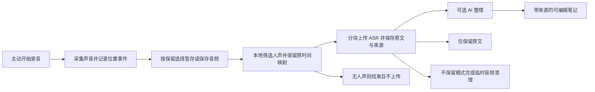

# MANGA 界面与工作流设计

| 项目 | 内容 |
| --- | --- |
| 文档编号 | DESIGN-MANGA-UX |
| 版本与日期 | 0.5 / 2026-10-06 |
| 状态 | 交互评审稿；视觉数值为初始设计参数 |
| 治理与决定 | [文档治理](../governance/documentation-policy.md)；[用户待办](../../USER-ACTIONS.md)；文档状态不代表实现通过 |
| 输入 | [产品需求](../product/requirements.md)、[领域模型](domain-model.md)、[Agent 协议](agent-and-plugins.md) |

## 1. 交互原则

界面与编辑基础采用 [ADR-0007](../decisions/0007-technology-stack.md) 的 React、Radix、Tiptap/ProseMirror 与对应源编辑场景的 CodeMirror 6。选型不改变下述工作流、块/引用身份、业务历史与后台生命周期；当前 M0 textarea 的人工证据不继承到新界面。首版 UI 为中文并保留多语言扩展；语义 Token 和主题数量仍按待决范围处理。

1. 阅读/创作页以内容为主，Agent 为可收起的副驾驶；独立 Agent 页以交流、任务和结果为主面板。
2. 阅读、记录和创作的切换保留正在进行的工作。
3. 记录先明确保存到哪里、引用哪里，再提供智能整理。
4. Agent 展示使用材料和结果去向，用户可以控制任务与撤销修改。
5. 失败保留已完成的工作，并给出可以继续操作的恢复入口。

## 2. 应用壳与三栏布局

### 2.1 默认结构

```text
┌──────────────────────────────────────────────────────────────────────────┐
│ 侧栏图标       当前内容标题             命令入口       任务与录音状态    │
├───────────────┬─────────────────────────────────┬────────────────────────┤
│ 模式菜单      │ 当前资源 / 工程                      │ Agent                  │
│ 功能导航      ├─────────────────────────────────┤ 上下文与来源           │
│ 笔记          │                                 │                        │
│ 已打开会话    │            主面板               │ 会话 / 当前任务        │
│ 资源 / 工程   │                                 │                        │
│ 粗剪          │ 阅读、观看、编辑或组织材料       │ 结果、引用与操作       │
│               │                                 │                        │
│ 设置 / 模块   │                                 │ 输入与任务控制         │
└───────────────┴─────────────────────────────────┴────────────────────────┘
```

上图表示空间足够时的区域关系，不要求每个页面常驻三栏。页面入口按模式和启用模块动态显示。M1 尚未交付的功能不显示成可以使用的空页面。独立 Agent 页以会话为主面板，阅读页以正文为主面板，设置与资源页也使用剩余宽度，不预留没有内容的副驾驶栏。

### 2.2 尺寸与响应

| 区域 | 初始建议 | 行为 |
| --- | --- | --- |
| 左栏 | 默认 224 px，可调约 200—280 px | 可折叠为约 56 px 图标栏或完全隐藏 |
| 主面板 | 优先分配剩余宽度，640 px 为阅读/编辑初始目标，非窄窗硬下限 | 宽屏可分屏，正文行宽另设上限 |
| 右栏 | 默认 360 px，可调约 320—480 px | 可隐藏，小窗口采用抽屉 |
| 顶部壳 | 侧栏图标、标题与必要任务入口融入同一紧凑区域 | 专注状态减少装饰；窗口控制、退出入口和快捷键仍可访问 |

初始设计曾建议 960 × 640 px；`main @ a688713` 的 Electron 实际最小窗口为 720 × 540，默认 1280 × 840。A-32 明确要求手机比例窄长窗口；本轮将代码下限降至 360 × 360，新增 360 × 780 CSS 视口验证目标，这仍是可调整值。M1b 同时覆盖这些尺寸、宽屏与窄长窗口，记录 CSS 视口、外窗大小和缩放的区别；最终基线仍按 Q-08 实测，不通过提高最小窗口掩盖布局问题。断点按实际可用空间计算：先收起辅助区域，为主面板保留空间；不足以常驻时左右栏转为覆盖浮层。高度不足时压缩装饰和次级工具，内容与操作区分别有可达的滚动路径，不把输入、保存或停止入口挤出窗口。

专注状态仅保留主面板及必要的可唤回控制。左右栏、顶部壳、面板宽度与分屏分别保存为用户布局偏好；模式可有不同布局。

### 2.3 显示状态与业务状态

- 隐藏 Agent 不取消正在进行的任务；全局任务入口可查看和停止。
- 隐藏导航不卸载模块；切换标签不自动清空草稿。
- 播放和录音会话由业务服务持有。是否在切换内容时暂停由用户偏好决定，并显示实际状态。
- 模式切换调整导航和默认建议，已经打开的内容仍保留，包括从另一模式打开的页面。

### 2.4 隐藏侧栏与悬浮展开

UI-06 的“悬浮面板”包含可操作的侧栏内容，按钮提示只是辅助标签。标题最左端提供左侧栏图标，右辅助区域使用对应图标；图标具有可访问名称与提示。侧栏不可用时不显示空入口。宽窗常驻、用户主动隐藏、空间不足自动隐藏与临时浮层是不同状态。

- 正常宽窗侧栏占据布局空间，按钮用于收起/恢复常驻，不以浮层遮挡主面板。只有视口不足以常驻时，鼠标悬停按钮才临时展开；指针从按钮移入面板可连续操作，移出且面板内无焦点时收起。延迟和防抖由实现试验决定，不能产生来回闪烁。
- 点击、Enter 或 Space 可固定打开浮层；无悬停设备通过点击使用。键盘有明确关闭入口，Esc 关闭后恢复到触发按钮；悬停本身不抢走编辑焦点或提交输入法组合。
- 窄窗同一时刻优先展示一个辅助浮层，避免左右同时覆盖全部正文。浮层有可见边界、可滚动内容及关闭入口；关闭后原正文选区、阅读位置与草稿保留。
- 自动折叠属于当前视口的派生状态，不覆盖用户保存的面板宽度和显隐偏好；恢复宽窗时恢复可容纳的用户布局。临时悬停状态不在重启后强行恢复。
- 隐藏侧栏不卸载模块、不复制会话；正在运行的任务及后续录音仍有全局状态和停止入口。

### 2.5 工作模式菜单与沉浸式标题

UI-07 在左侧栏顶部以观测者/造物主双选项显示当前模式，旁边保留带当前模式可访问名称的展开按钮，不放在标题栏。双选项提供直接点击/键盘 Tab 入口；菜单方向键选择、Enter 确认、Esc 退出并恢复焦点。工作模式与 Agent 主页面/副驾驶的展示位置分别管理；也不把模式菜单用作 Profile、模型或 AI runtime 切换。显示名更新后持久值仍为 `enthusiast` / `creator`，不重建布局、会话或草稿。

M1b 两种模式访问同一资源和笔记，造物主模式只呈现已交付入口；白板、导图、项目和粗剪继续按原阶段实现。切换过程中若保存尚未完成，保留草稿和真实保存状态，不重建业务对象或重发运行任务。

沉浸式标题以减少独立标题带和重复页面标题为目标，统一顶部表面与主工作区。Electron 实现需要验证拖动区与控件的非拖动区、最小化/最大化/还原/关闭、系统快捷键、贴靠及长标题省略；不要求透明材质或额外动效。系统按钮保留命中区域，不被菜单或浮层遮住。

UI-08 的主面板占用剩余空间；阅读正文行宽与壳宽分开设置，宽屏可用于记录、资料或用户打开的分屏。减少固定外边距、空辅助栏与重复说明；不能通过缩小字号、移除可访问标签或自动铺开尚未启用的功能来提高利用率。

### 2.6 打开的会话与资源占用

左栏上部提供功能入口，下部列出当前打开的会话；观测者模式对应资源，造物主模式对应工程。关闭标签只关闭视图；保存的笔记、进度、引用和已发出的任务不随标签销毁。切换后右栏显示该会话的 Agent 和材料，晚到结果仍归原会话。M1b 先实现已交付阅读资源的会话基础；漫画/动画随 M2、工程内容随 M3 接入。

非活动且未播放的媒体保留轻量身份、进度、用户偏好和恢复描述，暂停解码、渲染与高频轮询，并按预算释放帧/图片缓存。后台播放是显式行为，不能因切换页面暗中创建更多播放器。测试同时打开多个合成资源，记录前后台 CPU、内存、解码活动和恢复时延；预算见 Q-11，未测不得宣称低占用。

## 3. 视觉与可访问性

### 3.1 初始视觉参数

2026-09-24 起，这一版应用壳精确颜色、间距、圆角、面板阴影和响应式组件样式由 [styles.css](../../apps/desktop/src/renderer/styles.css)作为代码正本，不在文档另维持一张颜色表。语义 Token 包括背景、表面、次级表面、分隔线、文字、次级文字、强调色/轻背景、品牌标志、危险与焦点。浅灰壳、白色内容面板、淡粉选中态与深粉操作文字形成层级；浅分隔线不承担唯一焦点提示。

粉色用于主要动作、选中、焦点和少量状态提示；正文与长时间阅读以深色文字和稳定背景为主。阅读器可以单独调整背景、字体和行宽，不改变应用壳的品牌主题。

M1a 原型代码中的语义 Token 位于 `apps/desktop/src/renderer/styles.css`。2026-09-20 已授权先形成一版可替换主题；字体可选系统栈（含 Segoe UI）、HarmonyOS Sans SC，代码字体按需提供 JetBrains Mono，并保留本机字体回退。采用字体资产前核验许可、中文覆盖与离线打包。最终自有主题数量、数值与窗口基线仍按 Q-08 评审；不把参考候选视为全部已选或验收通过。

正文对比度目标至少 4.5:1，关键控件边界和焦点需清楚可见；浅分隔线只能用于装饰，不承担唯一的控件边界。状态同时提供文字或图标，不只依赖颜色。

### 3.2 键盘与输入

- 命令面板、资源导航、笔记编辑、引用跳转、录音和任务停止都提供键盘路径。
- 焦点移动顺序与视觉顺序一致，抽屉/弹窗有明确的进入、退出和焦点恢复。
- 中文输入法组合期间不提交段落、不触发快捷命令，也不破坏选区。
- 快捷键可配置，避免覆盖输入框、阅读翻页和系统快捷键。
- Esc 关闭临时浮层，不能无提示地丢弃已录音频或编辑草稿。
- 动画保持轻量，尊重减少动态效果偏好；大列表、画布和内容页面采用渐进加载。

### 3.3 首版界面切片

A-37 的本地实现范围为现有小说阅读、笔记、对话/副驾驶与共享壳，并提供“动画 · 演示”。左栏显示品牌、双模式、带线性图标的已交付功能、打开会话与底部设置；资源占位封面使用本地矢量图标，不制造不存在的收藏。右栏标题、当前模式、上下文、材料、消息与输入区复用同一会话业务状态。输入靠底部，窄窗辅助区以可关闭浮层显示；授权句柄和工具 JSON 收入“任务详情”，不放在普通消息主层级。

动画演示以画面为主，下面依次是封面、标题/集数、分类、模拟进度、笔记/标记/字幕操作与七集缩略图。宽窗七列，小窗三列；画面高度随可用视口约束，主区可滚动。素材为用户本次提供画面的裁切，离线随包加载，无运行时网络依赖。所有集使用同一静帧的视觉变体，不声称是七段视频。

演示页面与真实阅读/笔记完全分开：计时、倍速、跳转、字幕、标记和时间点笔记只在本次内存状态中变化；离开页面暂停计时，返回保留演示位置，退出应用清空。右栏明确标注预设对话，不发送模型请求；保存动作叫“保存演示笔记”，点击来源卡回到记录时间。正式媒体能力、持久视频引用和字幕解析仍留在 M2。

M1b 时的图像和行为证据已归档（见 [M1b 总结](../evidence/m1b-summary.md)）。代码位于 `shell.tsx`、`brand.tsx`、`animation-demo.tsx`、`App.tsx` 和 `styles.css`；此处文件均在 `apps/desktop/src/renderer/`。Q-08 最终视觉批准、真实 IME 与系统 DPI 未因此通过。M2 真实播放器可用后，动画演示页及其素材按 [M2 计划](../delivery/m2-media-mvp-plan.md) P4 移除。

### 3.4 M2 三媒介界面（2026-10-03 参考）

> 2026-10-06 起，本节中的点击卡片直接打开、导航跟随打开的资源、顶部壳录音按钮、阅读器内的笔记按钮、右栏状态列表和资源库页的导入按钮由 [3.5](#35-m2-人工反馈后的界面结构2026-10-06) 替代。

2026-10-03 用户提供三张参考图（书架页、漫画阅读器、小说双页阅读器，A-44）。参考图含第三方作品画面，只保存在开发机被 Git 忽略的 `dist/design-refs/m2-2026-10-03/`，不进入公开仓库；本节是它们的文字正本。图中作品、角色、评分和对话只是示意，界面不得内置。实施范围见 [M2 全阶段计划](../delivery/m2-media-mvp-plan.md)，最终视觉数值仍按 Q-08 在稳定包上评审。

**共享壳。** 左栏自上而下：品牌与标语；观测者/造物主双选项（沿用 A-32/A-37）；功能导航“总览、对话、小说、漫画、动漫”（“游戏”属 vNext，首版不显示，见 Q-10）；下部分组列表按媒介显示数量（如“小说 (8)”），可展开，列出最近打开或已打开的资源会话，每项带小封面、标题、作者或当前话/页（如“第 01 话 · 12/28”），当前会话高亮并带继续图标；分组旁有“管理”入口进入对应资源页；底部“设置”。分组标题文案待 Q-18。右栏为“MANGA Agent”：标题、快捷任务标签行（资源库为“书籍分析 / 剧情解析 / 角色分析 / 创作助手”，漫画阅读为“漫画分析 / 剧情解析 / 角色分析”，小说为“剧情解析 / 角色分析 / 世界观设定”），对话区，回答中引用资源时显示带封面的资源卡片及“查看详情 / 打开”按钮，回答下方可有建议追问标签，底部输入框。快捷任务把预设问题连同当前上下文作为一条可见的用户消息发送，不是隐藏指令。参考图中“为你推荐相似作品”的位置显示“相关作品”：已关联条目的 Bangumi 关联条目（标注续集、前传等关系，本库已有的标“已在书架”）和本库中标签相近的作品，每项标明来源，不调用模型；模型生成的推荐见 Q-21。录音按钮与状态（文字、提示灯、时长）在顶部壳的任务与录音状态区，三种阅读器工具栏也提供录音入口，交互见第 7 节。标题栏右上角最小化/最大化/关闭按钮颜色跟随应用主题。

**资源库页（参考图 1）。** 页面标题如“我的书籍”（单媒介页为“我的漫画”等）；右上为搜索框（书名、作者或标签）、主按钮“导入”（粉色）、次按钮“导入本地文件”和更多菜单。其下为书架状态标签“全部 / 在读 / 想读 / 已读 / 搁置”，右侧为网格/列表切换、排序（最近打开、最近添加、标题、进度）与筛选（格式、是否已关联资料、有无笔记）。“全部”页按媒介分区，每区标题为图标 + 名称 + “共 N 本/部”，右侧“查看全部”；区内横向一行卡片，可左右滚动。书籍与漫画卡片为竖版封面，动漫卡片为横版画面并叠加播放图标。卡片下方：标题、作者或制作方、当前进度文字（如“第 101 话 尼瑙”“第 12 卷”“更新至第 28 集”），以及状态标签（在读、搁置）或带百分比的进度条（“已读 78%”）；卡片右上“…”菜单含打开、详情与匹配资料、更换封面、设置状态、移出资源库。无封面时显示本地占位图形而非空白。空库、加载中、部分失败、离线与模块停用都有对应状态。

**作品详情。** 从卡片菜单或右键进入，可为抽屉或页面：封面（可更换、锁定）、投影后的标题/原名/作者/简介/标签/评分（每个字段标明来源，如 Bangumi 或文件内置资料，以及抓取时间）、卷/话/集列表（可带 Bangumi 集标题）与各自进度、相关笔记、录音回顾、相关作品、书架状态；“匹配 Bangumi”打开候选列表，人工确认后才关联。

**漫画阅读器（参考图 2）。** 顶部工具栏：返回、作品名 + 话标题 + 媒介标签、页码选择（“第 12/28 页”下拉）、上一页/下一页、书签、适配与全屏、更多。点击设置打开“阅读设置”面板：阅读方向（从左到右 / 从右到左）、显示模式（单页 / 双页 / 连续滚动）、自动翻页开关及间隔、翻页动画（淡入淡出 / 滑动 / 无，减少动态效果时为无）、高级设置（封面单独显示、缩放与铺满方式、预加载）。主区显示页面；底栏：作品小封面与标题、话标题、上一页/下一页与“12 / 28”、视图按钮（适配宽度、适配高度、原始大小、全屏）。键盘左右键遵循阅读方向，另有空格、PageUp/PageDown、Home/End 与缩放快捷键；框选区域后可记笔记，来源卡片返回同一页与区域。

**小说阅读器（参考图 3）。** 顶部：返回、书名 + 媒介标签、作者与当前章节；右侧“书签”和更多。工具栏：A- / A+ 字号、字体下拉（系统已安装字体与预设）、五个背景色块（白、书本黄、护眼绿、青绿、深色）、单页/双页切换、“按书籍比例”页面比例、宽度与全屏、“更多设置”（行距、边距、段距）。双页模式以对开页显示，页眉为书名 · 章节，页脚为页码；单页模式保留 M1b 的滚动阅读。阅读器背景只影响正文区域，不改变应用壳主题。现有选区、笔记、来源返回、查找与进度行为不变。

**动漫播放器。** 参考图未包含，沿用 A-33 与 READ-03：画面为主，控制条含播放暂停、进度条（含片段标记与录音区间）、时间与帧号、倍速、音量、字幕与音轨选择、全屏；画面下方为作品信息、集列表（横版缩略图与集标题）和笔记操作。文件需要播放副本时（无硬件 HEVC 或不支持的音轨），画面区显示原因、“生成播放副本”按钮、进度与取消，而不是黑屏。默认快捷键按 Q-13 推荐值实现并可在后续调整。

### 3.5 M2 人工反馈后的界面结构（2026-10-06）

2026-10-06 用户在 `e09802f` 稳定包上试用后提出反馈，决定见 A-47—A-52，实施见 [M2 计划第 14 节](../delivery/m2-media-mvp-plan.md#14-人工反馈返工2026-10-06)。本节是返工后界面的文字正本；与 3.4、4.3、4.5、第 6 节冲突时以本节为准。3.4 中未被本节改变的部分（资源库卡片、小说阅读器工具栏、左栏分组等）继续有效。参考图仍在本机 `dist/design-refs/m2-2026-10-03/`。

**总原则：观测者模式的读写分离。** 阅读和观看时，主面板只做资源的只读操作：浏览、打开、翻页、播放、缩放、选择文字或画面区域。产生记录的操作（记笔记、录音、提问）都在右栏完成；在主面板上做的选择只作为引用标签带进右栏输入框。作品资料的编辑与外部匹配在作品主页进行，不属于阅读页。

**主页面保持简洁。** 每个页面只直接显示常用操作，其余收进“…”菜单或设置面板。判断标准：一次阅读或观看中会反复用到的才常驻（翻页、播放暂停、进度、页码、全屏）；设定一次就很少再改的放进“…”（漫画阅读方向、单双页、自动翻页、翻页动画、字幕样式、音轨、帧号输入、逐帧、播放副本等）。提示用短暂通知（右下角，数秒后消失；错误保留到关闭），不在主面板上方常驻横幅。

**左栏与导航。** 观测者导航为“总览、对话、小说、漫画、动漫”，底部为“设置”；原“笔记”入口并入设置的“记录”。“小说/漫画/动漫”始终打开对应书架，不随正在打开的资源变化。已打开的资源在左栏下部按媒介分组列出，每行显示小封面、标题和当前位置（如“第 01 话 · 12/28”“第 3 集 · 12:30”“第二章 · 34%”），点击回到该资源会话并恢复位置；不显示“资料 · 0”之类的内部计数。

**作品主页。** 点击书架上的作品卡片进入作品主页，不直接打开文件。布局参照 Bangumi 条目页：
- 头部：封面、标题与原名、作者或制作方、媒介与年份、话/集数、评分（标明来源站点与抓取时间）、标签。
- 主按钮：“阅读”或“观看”，有进度时为“继续阅读 · 第 3 话 12/28”，点击才打开文件。旁边是书架状态选择、“匹配 Bangumi”（已关联时显示“Bangumi #464376”及菜单：刷新资料、更换条目、取消关联、在浏览器打开）、“编辑资料”和“…”（更换封面、移动资源、移出资源库）。
- 页签：概览（简介与全部资料字段，每个字段标明来源）、卷/话/集（列表与各自进度、单独打开）、角色（角色、关系与声优）、制作人员、记录（该作品的笔记与录音）、相关作品。
- 编辑资料：所有字段都显示并可填写，包括为空的字段；保存为用户修改，可锁定，可恢复为来源值。
- 返回书架时保持原书架的筛选与滚动位置。

**匹配 Bangumi。** 只能在作品主页由用户点击发起。对话框有两种方式：关键词搜索（预填标题，按媒介过滤类型）；按 ID 或链接（接受 `464376`、`subject/464376` 与 bgm.tv、bangumi.tv、chii.in 的条目链接）。选中条目后先显示预览（封面、名称、类型、日期、话/集数），条目类型与作品媒介不一致时提示但允许继续。确认前列出将要改变的字段与封面，用户可逐项选择“保留本地”；不确认就不写入。刷新资料同样先显示差异。书架上不再有“为未匹配作品查找”的批量入口。

**阅读与观看页。**
- 漫画：顶部为返回（回到作品主页）、标题与话、页码选择、上一页/下一页、全屏和“…”；“…”打开阅读设置（阅读方向、单页/双页/长条、封面单独、适配方式、自动翻页、翻页动画、预加载）。底栏为话标题、页码与进度条、视图（适配宽度/适配高度/原始大小，缩放在其中；也可用 Ctrl+滚轮与快捷键）。缩放小于 100% 时页面缩小并居中，大于 100% 时可滚动，适配方式随窗口大小变化。
- 动漫：配色遵循白、灰、粉：画面区域为黑色衬底，控制条为浅色表面、灰色图标、粉色进度与选中态，与应用其他部分一致。常驻：播放暂停、进度条（含笔记与录音标记）、时间与帧号、音量、倍速、全屏和“…”；字幕、音轨、帧号跳转、逐帧、播放副本等收进“…”。画面下方为剧集列表。A-B 片段在播放器中标记后，作为引用标签进入右栏输入框。
- 小说：工具栏按 3.4，“更多设置”之外的不常用项收进“…”。选中文字后，选区作为引用标签进入右栏输入框。
- 三种页面上都不再有“记笔记”“录音”按钮。
- 窄窗时阅读器顶部的作品标题裁切显示（末尾省略），不与页码、按钮重叠；完整标题在标题栏。

**右栏：聊天窗口。** 右栏是当前资源会话的对话记录，不再罗列状态：
- 消息流按时间排列：笔记气泡、语音气泡、向 Agent 的提问与回答。笔记气泡带来源标签（如“第 12 页 · 区域”“12:30—12:45”“第二章 · 选区 128 字”），点击跳回来源；可就地编辑、删除（需确认）或引用来提问。语音气泡显示录音状态（录音中、转写中、已完成）、转写文字与各段来源，保留音频时可回放。
- 输入框：上方是引用标签行（当前选区、画面区域、A-B 片段、附图，可逐个移除）；输入框内有“笔记 / 问 Agent”切换（资源会话默认“笔记”，记住上次选择；切换只在有归属的地方出现——打开的资源和作品主页，书架、资源库等没有资源或作品的页面上输入框只问 Agent，也不改动记住的选择，避免写出一条无处显示的笔记）、麦克风（单击开始/停止，按住说话，松开结束）、附件与“+”菜单（联网、放宽字幕范围、选择材料等仅对本次发送有效的选项）、发送。
- 快捷任务标签在输入框上方，来自设置中当前页面适用的快捷任务。
- 未配置模型时，在输入框上方显示“尚未配置模型”和“去设置”，“笔记”模式不受影响。
- 右栏收起（专注、窄窗）时，主面板右下角显示悬浮胶囊：麦克风与记笔记；点记笔记弹出小输入框，发送后与右栏发送等效。录音中胶囊显示状态与时长。有自己底栏的页面（漫画页、播放器，全屏除外）上胶囊停在右上角、标题栏之下，笔记框向下展开；标题栏下方的提示条（框选提示、警告、来源卡）与播放器的字幕提示让出胶囊所在的角，胶囊不压住任何控件。没有资源或作品可归属的页面上，胶囊只有麦克风。
- 作品主页的右栏同样是对话；在这里发出的笔记关联到作品，不带阅读位置。

**对话页。** 整个主面板就是对话，不显示右栏，参照 Codex、Claude 桌面版：对话列表在左栏下部，主面板居中显示消息流（限制行宽），输入框在底部；空对话显示快捷任务与可用能力。

**标题栏。** 左侧为侧栏开关与标题，右侧为：上下文调试按钮、录音中的状态（文字、提示灯、时长，点击停止，只在录音时出现）、扫描或任务进度（只在进行中出现，点击打开对应设置页）、右栏开关，以及跟随主题的窗口按钮。删除原来打开录音回顾的麦克风按钮。

**上下文调试面板。** 点标题栏按钮（或快捷键）在主面板下方展开，可调整高度，只读，用于调试：
- “当前”：下一次发送将使用的上下文，包括会话、资源与修订、位置与选区、字幕窗口、材料、模型路由、可用工具与授权范围。
- “上次任务”：最近一次运行冻结的快照、发给模型的消息、工具调用与结果、用量。
- “事件”：本会话最近的领域事件与通知。
- “复制 JSON”：凭据始终隐藏，图像字节只显示尺寸与哈希。

**设置界面。** 进入设置后，左栏换成设置导航，主面板换成设置内容，不显示右栏；左栏顶部“返回”回到进入前的页面。内容区居中，每行左侧为名称与说明、右侧为控件。导航分组：
- 基础设置：常规（数据位置、启动、语言）、外观、阅读与播放（三种阅读器的默认值）、录音（设备、保留策略、降音或暂停、悬浮框）、资源库（见下）、资料来源（Bangumi 开关与 access token）、存储与备份（资源总览、位置迁移、备份与导出、缓存）、模块、键盘快捷键。
- Agent 能力：模型（连接、用途路由、运行时）、快捷任务、使用记录。
- 记录：全部笔记与录音，按作品、媒介、类型、时间、状态（如待转写、待处理、已清理）筛选和搜索；可打开笔记编辑、回放录音、重试转写、清理待处理音频，或跳到来源（退出设置并打开资源）。笔记在单独的笔记页打开，其“返回”与设置一样回到打开它的页面（记录列表、作品主页的记录页签、左栏所在的页面）。
- 日志：关键操作记录，按类别、操作者（用户、Agent、系统）、对象和时间筛选。

**资源库设置与扫描。** “资源库”页列出资源库路径，每条有媒介（小说/漫画/动漫）、路径、是否参与自动扫描、上次扫描时间与结果（新增、变化、不可用、失败数）、“立即扫描”和“移除”（只停止扫描，不删除已有作品）。页面上方是扫描计划（启动时扫描、间隔：关闭/30 分钟/1 小时/6 小时/每天；默认启动时扫描、每 1 小时一次，可改）和当前进度（阶段、已处理/总数、当前项、取消）。单次导入文件或文件夹也在这里，检查阶段同样显示进度。扫描在后台进行，界面始终可操作。资源库完全为空时，应用打开到这个页面；某个书架为空时，书架显示一行说明和“添加资源库路径”链接，不显示导入按钮。

**快捷任务设置。** 列表可排序、启用或停用、新建、复制、删除、恢复默认。每个快捷任务有名称、提示词模板、适用页面（资源库、作品主页、小说、漫画、动漫、对话）、是否附带当前画面，以及发送方式（直接发送或填入输入框）。模板可插入占位符（作品、作者、当前位置、选区、字幕窗口、用户输入），编辑器校验未知占位符。发送时显示为带“快捷任务”标记的用户消息，可展开查看实际文本。

## 4. 信息架构

### 4.1 观测者导航

最近 → 资源库 → 小说/漫画/动画 → 收藏与进度 → 记录 → 搜索。

资源详情展示作品与版本、文件可用状态、卷章/集、最后位置、相关记录和引用。进度以用户能理解的章节、页、时间和完成状态显示。

阅读页首屏以资源为单位显示有界列表，同一本书的多个修订不重复占位。全库书名搜索支持继续加载，后续页沿用查询条件，总数始终表示完整匹配集。打开结果、保存阅读偏好等无关刷新保留已加载列表；资料库快照变化时重置首屏与搜索框，避免界面条件和结果不一致。分页与同规模性能的自动证据见 [M1b 总结](../evidence/m1b-summary.md)。

### 4.2 造物主导航

项目 → 材料 → 笔记 → 白板 → 思维导图 → 文案 → 粗剪。

项目首页展示目标、最近对象、材料来源、未处理记录与任务。个人资源可以从材料入口加入，已有笔记默认以引用方式加入项目。

### 4.3 Agent 主页面

全局导航提供独立“Agent”入口（界面名“对话”），M1a 首先交付；M2 返工起对话页不显示右栏，结构见 [3.5](#35-m2-人工反馈后的界面结构2026-10-06)。主面板包含会话列表、消息、已选材料、文本/语音输入、任务进度、工具结果与停止入口。空会话展示可执行能力与连接设置入口；未交付模块不伪装成可用工具。

全局 Agent 入口与资源/工程右侧助手复用运行和业务服务；展示同一会话时共享任务身份，各资源/工程会话之间独立保存上下文、材料、环境和任务关联，不沿用一个全局会话冒充隔离。切换展示位置不复制任务、不重新提交请求，也不更改任务材料或目标版本。用户可核对工具输入摘要、执行结果、生成对象和来源，用同一页面验证已接入功能。诊断信息按需展开，凭据始终隐藏。

### 4.4 首次配置与资源总览

首次启动先展示当前通道（开发/正式）、数据根目录及资源/工程默认目录；默认使用系统“文档”已解析位置下的 MANGA 子目录，不拼写用户路径。用户可逐类选择位置，再配置文本/转录连接、模型与常用录音偏好；在线配置允许跳过，完成后都能在设置修改。

“资源总览”是独立页面，汇总小说/漫画/视频、项目/笔记/剪辑、附件/录音、下载、备份和可再生缓存。展示类别、数量、所在位置、索引或托管方式、占用与可用状态，支持筛选、打开、定位和修复。未安装模块的数据保留可读状态。磁盘扫描异步进行且可取消；资源失联时保留条目。UI 与 Agent 查询相同目录和资源服务，密钥等私密配置不进入总览。

### 4.5 设置

设置按用户任务组织为：外观与阅读、声音与录音、AI 功能与模型、模块、资源与存储、备份与导出、快捷键。M2 返工起设置是独立界面，分组为基础设置、Agent 能力、记录、日志，见 [3.5](#35-m2-人工反馈后的界面结构2026-10-06)；下文各项内容归入对应分组。

AI 设置明确提供 API key、base URI、协议类型、模型 ID、超时和适用的生成参数。LLM、Embedding、ASR 独立绑定模型、连接和凭据并分别测试能力，可显式选择同一服务，但不自动继承另一用途配置；兼容服务不支持模型列表时允许手动填写。显示归一化后的请求基址和连接错误，密钥仅支持受控输入/替换与清除，不能回显到状态快照。资源与存储设置列出所有应用生成内容的位置、用途与迁移入口，迁移前展示范围，结束后验证并提供恢复。

M1b 的声音与录音设置提供“保留音频/不保留音频”，说明后者仅为处理暂存，完成后仍可查看文本与来源，音频清理后无法回放。采集界面显示本次选择，改变偏好不追溯清理旧录音；初始默认及失败/取消清理时机按 Q-05 定稿。

## 5. 页面上下文交互

### 5.1 上下文栏

Agent 顶部用材料卡片显示当前准备使用的内容，例如：

- 《某小说》第二章，已选 128 字。
- 第 4 集，12:30，字幕范围 12:20—12:40。
- 当前漫画第 18 页，选中一个画面区域。
- 项目“角色关系整理”，已加入 3 条笔记。

用户可展开查看来源范围、移除某项材料或固定材料。没有截图/OCR/字幕时，界面如实显示可用信息，不以“已理解画面”代替实际提取状态。

### 5.2 跟随焦点与固定任务

默认准备区域跟随当前焦点，但发送任务时固定一次上下文。任务运行中切换页面，显示“此任务仍使用发送时的材料”；下一次消息是否改用当前焦点，由新的上下文栏明确呈现。

固定材料会持续出现在后续输入准备区，用户可以解除。切换项目时提示会话范围变化，既有任务保持原范围，不把其他项目的材料静默加入。

### 5.3 结果的落点

Agent 创建结果后展示对象卡片和位置，例如“已保存到个人笔记”或“已加入项目材料”。修改对象时显示目标名称、差异入口与撤销；目标版本变化则保留建议稿并提供比较。

## 6. 工作流 A：导入、阅读与带来源笔记

1. 用户选择文件或目录，导入面板展示识别结果、资源类型、重复项与失败项。
2. 默认索引原位置，托管复制作为明确选项；目录导入可以取消并保留已成功条目。
3. 打开小说后展示目录、进度、阅读设置和查找；正文选区触发轻量操作栏。
4. 选择“记录”后打开就近输入区域，显示来源片段和保存范围。
5. 输入正文或开始语音记录；保存时展示“保存中/已保存”，完成后提供笔记入口。
6. 从笔记点击来源，定位到原文并突出目标；用户可返回原来的笔记位置。

空库显示导入入口和本地使用说明。没有 AI 配置时仍可阅读和创建人工记录，智能功能入口说明所需配置。

M2 返工起（A-47、A-48、A-50）：第 1、2 步在设置的“资源库”页进行（资源库路径的后台扫描，或单次导入）；点击作品先进入作品主页，再从“阅读/观看”打开；第 3—5 步的记录在右栏输入框完成，选区作为引用标签带入；资源库完全为空时应用打开到设置的“资源库”页。

## 7. 工作流 B：口述感想与异步整理


```mermaid
flowchart LR
    A[主动开始录音] --> B[采集声音并记录位置事件]
    B --> C[按保留选择暂存或保存音频]
    C --> H[本地筛选人声并保留原时间映射]
    H --> D[分块上传 ASR 并保存原文与来源]
    H --> I[无人声则结束且不上传]
    D --> E[可选 AI 整理]
    E --> F[带来源的可编辑笔记]
    D --> G[仅保留原文]
    D --> J[不保留模式完成临时音频清理]
```

### 7.1 采集界面

- 初次使用选择麦克风，并清楚显示当前输入设备。
- 同时提供按住录音与切换录音模式。按住模式松开结束；丢失键抬起、失焦或设备失联时有明确结束/恢复处理，避免隐蔽持续采集。
- 录音时同时显示“正在录音”文字、提示灯、持续时间、输入活动和停止入口；波形不能替代真实状态。
- 后台录音显示悬浮框，含文字、提示灯、时长和停止入口；设置可调整默认出现位置与大小，支持移动/缩放，跨显示器/DPI 或屏幕断开后恢复到可见范围。悬浮框订阅同一采集会话，关闭主页面不产生第二个录音任务。
- 播放器可按设置在录音时降低音量或暂停；变化反馈明确，结束后恢复原设置。
- 用户切换页面或资源时继续记录位置事件，录音的来源不会被最后打开页面覆盖。

### 7.2 整理界面

状态区分“音频已暂存/已保存”“正在筛选人声”“上传/转录进度”“原文可用”“正在整理”“笔记已保存”以及“音频待清理/已清理”。长录音可查看分块完成与失败状态，全程无人声显示没有可转录人声且未上传。用户可以在整理期间查看已经保存的原文和来源。

笔记同时保留原文入口、整理稿、引用位置和可选录音回放。专有名词修改可以保存到项目术语表，但只有用户确认的修改才成为术语。

以消息气泡或分段进度条展示语音区间、转录文本与来源，用户可快速浏览、选择片段、跳到录音当时的小说位置/漫画页/动画时间；音频实际可用时提供对应区间回放。展示原始时间间隔与已筛除区间，不能让压缩后的连续进度误导来源时间。无音频时保留文本和跳转入口，明确无法回放；仅有粗粒度定位时显示待校准，不伪装逐句同步。分段选择、回放、来源跳转都提供键盘与可读标签，进度/失败状态不只靠颜色。

### 7.3 失败与取消

| 情况 | 显示与恢复 |
| --- | --- |
| 麦克风拒绝访问/不存在 | 显示设备问题与设置入口，不显示虚假的录音计时 |
| 外放对白被误收录 | 允许修改原文/删除片段，提供耳机、降低播放音量和采集设置入口 |
| ASR 失败 | 保留位置和已完成文本，显示音频实际保留/暂存状态；音频可用时重试，否则提示重新录制或手动输入 |
| 整理失败 | 原文可用，允许稍后重试整理 |
| 用户取消处理 | 保留已保存记录，显示已停止阶段；临时音频按明确策略显示恢复/清理入口，不假称已删除 |
| 临时音频清理失败 | 文本和来源继续可读，明确待清理并可重试，不提供虚假的已清理状态 |
| 来源定位不准 | 用户调整来源点/范围，保存修订记录 |

回声消除有设备与实现差异，交互上不使用“保证只录到本人”之类绝对表述。

录音的采集、人声筛选、音频保留选项、分段回顾与三种媒介的来源映射在 M2 阶段一并实现（A-46，原 M1b 录音子阶段并入）；在此之前产品没有设备录音流程。

## 8. 工作流 C：素材整理与互嵌

1. 从记录列表选择材料，加入项目；默认创建引用关系。
2. 拖到白板上生成来源卡片，显示标题、摘要和来源标记。
3. 对卡片进行移动、分组、连线或打开源内容。
4. 将材料加入思维导图节点，调整层级与顺序。
5. 在笔记中嵌入白板、导图或局部节点，通过展开和跳转查看。

嵌入卡片的菜单明确区分“打开源内容”“编辑源内容”“固定为快照”“复制一份”。编辑源内容时标注可能在其他引用位置同步更新。

循环嵌入或超出展开深度时显示可跳转卡片；模块停用时显示可读预览和启用入口。无效引用提供原信息与修复操作，不能仅留下空白区域。

## 9. 工作流 D：文案与资料搜寻

### 9.1 资料搜寻

用户输入检索意图，先查看本地材料；需要外部信息时启用已配置的检索连接。结果显示标题、来源、获取时间和片段，可以加入项目、建立引用或继续阅读。

保存材料时允许选择只记录链接、保留正文片段或保存允许获取的本地快照。来源版本变化后保留已有快照，并提供更新为新版本的选项。

### 9.2 文案生成与修改

用户选择目标文档/选区、使用材料与修改意图，Agent 返回提纲、候选稿或差异。用户可以整段采用、局部采用、继续修改或撤销。

文案界面保留材料引用。缺少来源支持的陈述以待核实内容呈现，生成文本不冒充原始引文。

原文被编辑时，旧候选稿进入冲突比较，允许作为新草稿保存。自动润色不能覆盖中文输入法正在组合的内容。

## 10. 工作流 E：视频粗剪

### 10.1 编辑

用户从播放器标记区间，或从笔记引用中添加片段。粗剪页面以片段列表/单序列时间轴展示来源、请求区间和顺序，提供拖动排序、区间调整和连续预览。

### 10.2 导出前预览

导出面板展示输出位置、容器、流选择、兼容状态、每段实际切点和预计处理方式。实际区间存在偏移时以时间差说明，例如“实际起点比标记早 0.38 秒”，具体数值来自后端探测。

不兼容时列出导致失败的素材和原因，允许调整片段或导出设置。首版仅支持编码/容器一致且流参数兼容的无转码方案，不能静默转码。

### 10.3 导出任务

启动后进入任务列表，提供进度、停止和结果入口。取消或失败保留编辑项目，并清楚处理临时输出。完成后显示实际文件与来源映射，原始素材不被导出操作覆盖。

## 11. 工作流 F：模块管理

模块页面按功能显示状态、提供能力、依赖、配置和存储占用。用户关心的名称为“小说阅读”“语音记录”“文案辅助”等，技术标识放在详情。

功能中心分别提供“隐藏界面、停用功能、卸载代码、清理数据”。一个用户功能可以映射多个模块，共享依赖仅在没有其他消费者时停用；关闭漫画阅读器后漫画文件、作品资料、进度和引用仍可管理。需要重启时显示待生效状态，不提前报告停用成功。

“动漫资料”首批为 Bangumi，设置按来源管理连接，提供单源、回退、多源搜索与字段合并方式，并显示字段来源和用户锁定值。“下载管理”首批使用 BitTorrent，随获取组合启用，展示计划中的来源、文件、目标目录和任务阶段；文件已下载与已入库分别显示。没有安装对应能力时，基础本地流程仍然完整。

停用操作先展示受影响项目：活动视图、进行中的任务、依赖模块，以及数据将保持保留。已存在授权足以完成停用时直接按方案执行；存在未处理草稿或必须选择的任务处理方式时，再给出具体选项。

停用成功后入口与工具同步更新；引用保留预览。重新启用后，重新注册服务和恢复可处理任务。卸载代码与清理数据为两个独立操作。

Profile 是运行装配方案，观测者/造物主模式只是布局。切换 Profile 需要依赖与任务影响检查；配置解析失败时可回到上次有效配置或恢复模式。具体产品行为见[组合方案](composable-ai-native-architecture.md)，换源与下载流程见[外部扩展](external-providers-and-acquisition.md)。

## 12. 工作流 G：备份、导出与引用修复

### 12.1 备份与导出

完整备份说明数据库、附件和外部媒体的覆盖范围。资料包导出则展示选择对象、依赖引用、是否包含媒体/录音和预计大小。

导入先预览对象数量、已有 ID 冲突、缺失模块和缺失媒体，再提交。冲突选项不默认覆盖用户现有内容。

### 12.2 修复来源

用户从失效卡片进入修复，选择候选文件或重新指定位置。系统展示内容校验结果与候选定位，用户确认后更新引用关系，并保留原锚点与修复记录。

同名但内容不同的文件不能显示为“已自动修复”。源对象被永久删除时卡片保留必要描述和删除状态。

## 13. 状态、反馈与通知

| 状态 | 用户能看到的反馈 |
| --- | --- |
| 正在保存 | 保存状态，必要时退出前等待或提示未完成内容 |
| 已保存 | 已持久化确认，重新打开能恢复 |
| 模型未配置 | 缺少能力与配置入口，已有内容继续可用 |
| 正在处理 | 明确任务阶段，真实可用进度，停止入口 |
| 等待输入 | 说明需要用户决定的具体事项 |
| 失败 | 保留结果与原始材料，显示可重试或修复操作 |
| 取消请求中 | 表明正在停止，不提前显示完全结束 |
| 已取消/已完成 | 与执行器确认状态一致 |

阅读与观看期间避免频繁弹出任务消息。普通后台处理只更新状态，完成、失败或需要用户操作时提供适度提示。提示可点击返回相关任务，不改变当前内容焦点。

首版中文文案集中使用稳定消息键，参数插值与日期/数字由本地化层处理，不拼接中文句子。后续语言可新增资源并配置回退，内容语言和界面语言分开；测试语言只用于检查扩展性，不代表额外发布承诺。

## 14. 交互验收清单

- 全部核心流程可使用键盘完成；输入法组合不被命令打断。
- 在最小窗口、标准缩放和高 DPI 下，正文与主要操作没有不可达区域。
- 左右栏和顶部壳隐藏后均能恢复；任务与录音状态有可发现入口。
- 窄长、宽屏和矮窗切换中，悬浮侧栏可经悬停/点击/键盘操作并退出；模式菜单、系统窗口控制与正文选区互不干扰，主面板空间随辅助区域收起而释放。
- 模式、标签和项目切换不会丢失已确认保存的内容，运行中任务目标不漂移。
- 同一来源从笔记、白板、导图和粗剪跳转具有一致行为。
- 引用、快照和复制的区别通过可见操作表达。
- 停用模块、断网、缺失文件和模型错误均有可继续工作的路径。

对应的场景测试、样本和状态记录见[交付阶段与验收计划](../delivery/roadmap-and-acceptance.md)。
